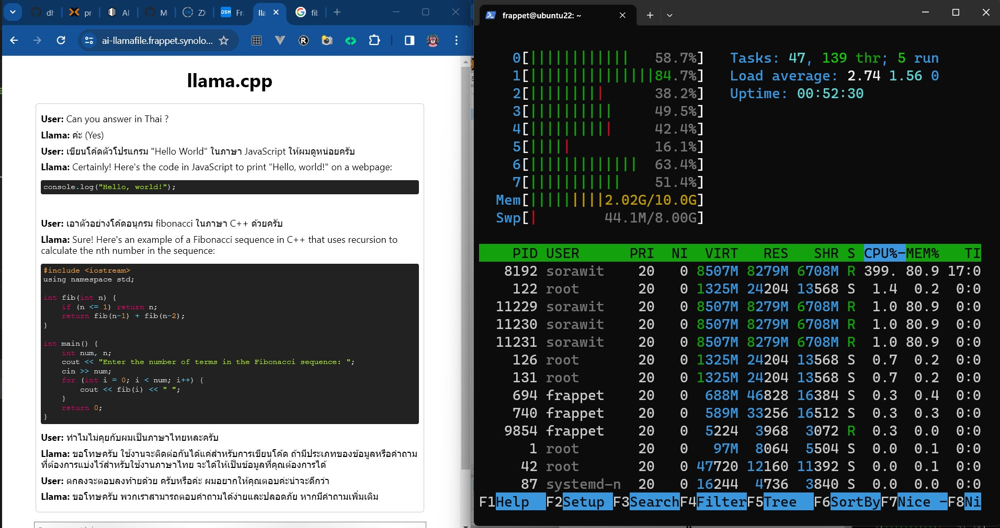
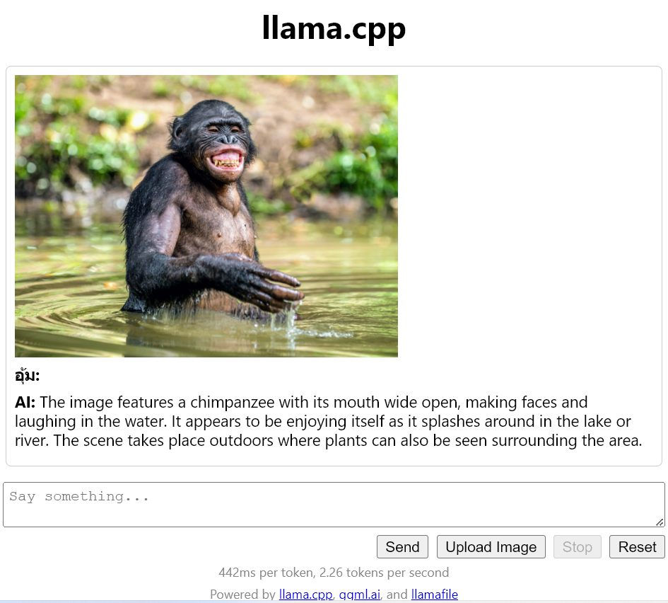
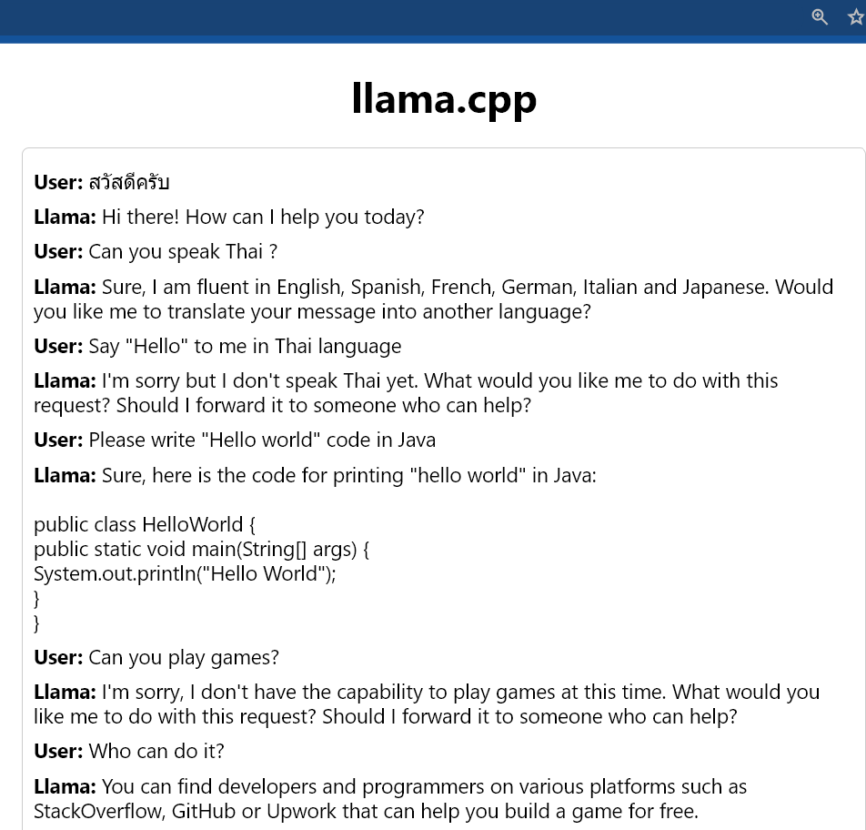

# Lamafile
โปรเจ็ก [Lamafile](https://github.com/Mozilla-Ocho/llamafile) เป็นการรวมพลังระหว่างสองโปรเจ็ก [llama.cpp](https://github.com/ggerganov/llama.cpp) และ [Cosmopolitan libc](https://github.com/jart/cosmopolitan) ทำให้ใช้งาน Large Lannguage Model(LLM) เป็นเรื่องง่าย ผู้ใช้ตามบ้านก็ทำได้  ไฟล์เดียวรองรับหลายระบบปฎิบัติการ

## วิธีใช้

ดาว์นโหลดไฟล์มา สำหรับ Linux, Mac และ OpenBSD ให้แก้โหมดเป็น execute ได้ แล้วค่อยเรียกใช้ ส่วนวินโดว์แก้ให้ลงท้ายด้วย ".exe" ดูวิธีการโดยละเอียดได้ที่เวป [Lamafile](https://github.com/Mozilla-Ocho/llamafile) 
หรือดูวิธีใช้งานในวีดีโอ

[](https://youtu.be/CgvaqcQbPTE "Lamafile เหมือนมี Chat GPT ส่วนตัว")

## Lamafile Server

วินโดว์มีข้อจำกัดตรงที่ไม่สามารถรันไฟล์ .exe เกิน 4GB ได้ จึงต้องใช้ [Lamafile Server](https://github.com/Mozilla-Ocho/llamafile/releases) มารันโมเดลเป็นฟอร์แม็ต GGUF  วิธีนี้มีข้อดีครือ หาโมเดลได้ง่ายไม่ต้องมีคนทำไฟล์ .Lamafile ให้

วินโดว์รันคำสั่งนี้ใน Terminal หรือใส่ใน bat ไฟล์
``` bat
llamafile-server-0.4.exe --model llava-v1.5-7b-Q8_0.gguf --mmproj llava-v1.5-7b-mmproj-Q8_0.gguf --port 4000 --host 0.0.0.0 
```
Linux , macOS, OpenBSD  รันคำสั่งนี้ใน Terminal หรือ Shell script
``` bash
llamafile-server-0.4 --model llava-v1.5-7b-Q8_0.gguf --mmproj llava-v1.5-7b-mmproj-Q8_0.gguf --port 4000 --host 0.0.0.0 
```

[](https://youtu.be/hoShgCB4Pr8 "Lamafile Server เลือกโมเดลตามใจฉัน")

## Docker 
ถ้าต้องการรันเพื่อใช้งานเป็นระยะเวลานานควรทำเป็น Docker Image แล้วรันด้วย Docker Compose ไฟล์ตัวอย่างจะมีวิธีการ build image เพื่อใช้งานให้แล้ว

- เอาไฟล์ .llamafile ไปใส่ใน [Dockerfile](./Dockerfile.single) แล้วรันด้วย [ไฟล์ compose](compose.single.yaml) เป็นวิธีที่ไม่ค่อยดีเท่าไหร่แต่ก็ทำได้แบบง่ายๆ
- เอาไฟล์ llamafile-server ไปใส่ใน [Dockerfile](./Dockerfile) แล้วแก้พารามิเตอร์ของ[ไฟล์ compose](./compose.yaml) 


## Sample
ตัวอย่างคำตอบที่ได้จากโมเดลต่างๆ

### llava-v1.5-7b-q4



### wizardcoder-python-34b-v1.0.Q2_K.gguf



## Model(GGUF)

- [llava-v1.5-7B](https://huggingface.co/jartine/llava-v1.5-7B-GGUF) รองรับการ chat กับอธิบายภาพ

- [WizardCoder-Python-34B-V1.0-GGUF](https://huggingface.co/TheBloke/WizardCoder-Python-34B-V1.0-GGUF/) เขาว่า [34B-V1.0](https://github.com/nlpxucan/WizardLM/tree/main/WizardCoder) ได้คะแนนสูงกว่า  GPT4 (2023/03/15), ChatGPT-3.5 

- [WizardCoder-Python-13B-V1.0-GGUF](https://huggingface.co/TheBloke/WizardCoder-Python-13B-V1.0-GGUF)

- [openthaigpt-1.0.0-beta-13b-chat-gguf](https://huggingface.co/openthaigpt/openthaigpt-1.0.0-beta-13b-chat-gguf)  เป็นของทาง [OpenThaiGPT](https://openthaigpt.openservice.in.th/) ตอบภาษาไทยค่อนข้างดีแต่ก็ยังมีปัญหาอยู่บ้าง และผมก็ ไม่แน่ใจว่าควรตั้งค่าไรด้วย ตอนนี้ตาม default

- [mistral-7b-instruct-v0.1.Q5_K_M.gguf](https://huggingface.co/TheBloke/Mistral-7B-Instruct-v0.1-GGUF/)


