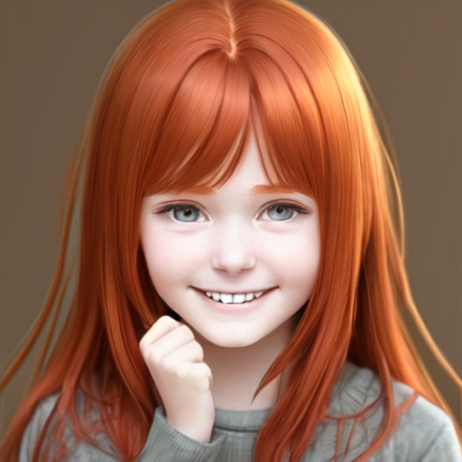
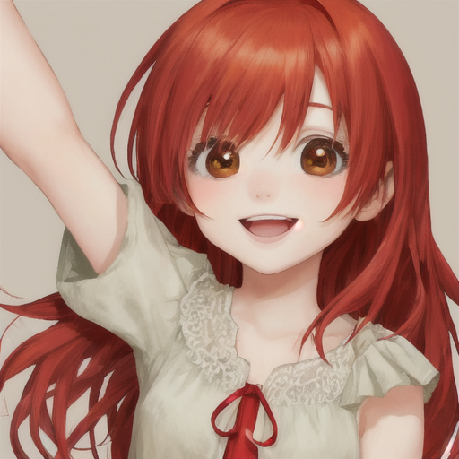
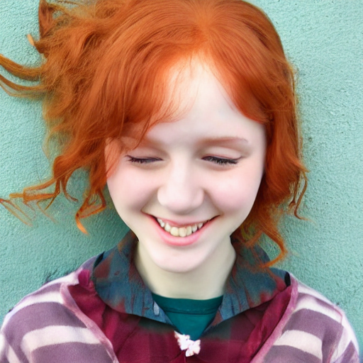
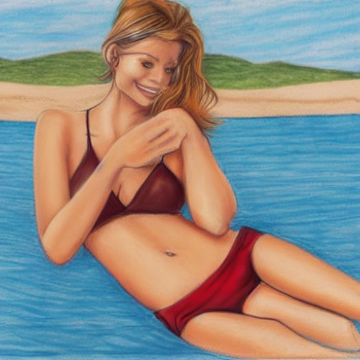

# Stable Diffusion
AI สร้างภาพมีอยู่หลายตัวเช่น DALLE, MidJourney ฯลฯ ส่วน Stable Diffusion เป็นที่นิยมใช้กันมากเพราะ OpenSource ใช้งานฟรี มีโมเดลให้เลือกมากมาย สามารถติดตั้งในเครื่องตัวเองได้ มีโปรแกรมให้ใช้ง่ายๆหลายตัว แนะนำให้ลองตัวแรกก่อน
- [Stable Diffusion Webui ตัวนี้นิยมและอัปเดตสุด (ดูวีดีโอ เพิ่มเติมในลิงค์)](./stable-diffusion-webui.md) 
- [SD.Next](https://github.com/vladmandic/automatic) Stable Diffusion implementation with advanced features
- [NMKD Stable Diffusion GUI](https://nmkd.itch.io/t2i-gui)

## Stable Diffusion Models
หรือบางทีเรียก  checkpoint  จะเป็นโมเดลที่สร้างภาพโดยมีสไตล์เฉพาะเจาะจง เนื่องผ่านการเทรน(สอน)ด้วยภาพสไตล์ที่เจาะจงมา มันไม่สามารถสร้างภาพบางอย่างได้ถ้าไม่มีการเทรนมาก่อน เช่นถ้าไม่มีภาพสุนัขในการเทรนก็ไม่สามารถสร้างภาพสุนัขได้ หรือถ้ามีการเทรนเฉพาะภาพสุนัขก็จะสร้างได้แค่ภาพสุนับเท่านั้น เราสามารถผนวกรวมโมเดลหลายๆตัวเข้าด้วยกันได้เพื่อให้สามารถสร้างภาพได้หลากหลายขึ้น มีโมเดลให้เลือกใช้งานฟรีมากมาย ในแบบต่างๆเช่น ภาพเหมือนจริง ภาพวาด ภาพการ์ตูน ฯลฯ

ถึงแม้จะใช้ prompt เดียวกันแต่ละ model จะให้ผลที่ต่างกัน

## ผลงาน
งานจะออกมาดีได้นั้นขึ้นกับหลายปัจจัย
- การสร้าง Prompt ที่ดี มีรายละเอียดและเจาะจง เหมือนการบอกเล่าให้คนอื่นฟัง  ไม่มีใครเห็นภาพที่เราคิดในหัวได้ จำเป็นต้องอธิบายให้ชัดเจน
ตัวอย่าง prompt ที่เขียนผิดกำกวมจะได้ภาพแปลกๆออกมา

"A realistic drawing of a beautiful girl in a blue shirt and blonde hair, wearing a swimsuit, sitting on the beach.""

- keywords 
มีคำเฉพาะบางอย่างที่จะมีผลมากว่าคำอื่นๆเช่น 
ชื่อดารา ชื่อศิลปิล ประเภทของภาพ เช่น illustration, painting, photograph

## Download Model

ส่วนใหญ่สามารถดาว์นโหลดได้ฟรื จาก [huggingface.co](https://huggingface.co/)  แต่จะค้นหายากเพราะรวมโมเดล AI เกือบทุกแบบเอาไว้ ถ้าต้องการโมเดลสำหรับ Stable Diffusion ต้องไปเวปที่ทำโดยเฉพาะ จะมีภาพและ prompt ตัวอย่างให้ศึกษา บางที่อาจจำเป็นต้องสมัครสมาชิกก่อน 
- โมเดลรุ่นใหม่ XL
  - [stabilityai/stable-diffusion-xl-base-1.0](https://huggingface.co/stabilityai/stable-diffusion-xl-base-1.0/blob/main/sd_xl_base_1.0.safetensors), 
  - [stabilityai/sdxl-turbo](https://huggingface.co/stabilityai/sdxl-turbo/blob/main/sd_xl_turbo_1.0_fp16.safetensors
)
- [Civitai](https://civitai.com) เวปรวมโมเดลค้นหาได้ง่าย
- [Stable Diffusion Art](https://stable-diffusion-art.com/)

## ข้อมูลเพิ่มเติม
- วิธีเรียกใช้งาน Model เจ๋งๆ ใน Stable Diffusion [ตอนที่1](https://www.thepexcel.com/stable-diffusion-part1/),
[ตอนที่2](https://www.thepexcel.com/stable-diffusion-part2)
- [AI Art Tutorial](https://www.youtube.com/watch?v=DHaL56P6f5M&list=PLXS4AwfYDUi63uBtSSMC6SFW9ruRy7qsX&index=1)
- [สอนสร้างภาพ AI บนเครื่องคอมพิวเตอร์ของคุณด้วย Stability Matrix ไม่ต้องรอเครดิต ไม่ต้องกลัวโดนบล็อก!](https://www.youtube.com/watch?v=sfuS4tzVZ6g)
- [Lexica](http://lexica.art) ไปดู prompt ตัวอย่างได้
- [ใช้งาน 4-6GB VRAM](https://community.graphisoft.com/t5/Archicad-AI-Visualizer/TIP-to-run-Stable-in-computers-with-4-6GB-VRAM/td-p/576192
)

- [สอนใช้ Ideogram.ai UX/UI ง่ายมากๆ เหมาะสำหรับหัดเจน เจนฟรีวันละ 100 ภาพ ไม่ต้องกดสะสมเครดิต!](https://www.youtube.com/watch?v=XjNKgmAn0VU)

- สอนใช้ Playgroundai.com สรัางได้ 500 ภาพต่อวัน แบบจุก ๆ ฟีเจอร์เพียบ!
[PART1](https://www.youtube.com/watch?v=iAZwf5z8lgo)

- [สอนใช้ getimg.ai สร้างภาพฟรี 100 ภาพต่อเดือน มาพร้อมฟังก์ชันจัดเต็ม](https://www.youtube.com/watch?v=gqBArkP2D9k)
- [สอนใช้ Ideogram.ai UX/UI ง่ายมากๆ เหมาะสำหรับหัดเจน เจนฟรีวันละ 100 ภาพ ไม่ต้องกดสะสมเครดิต!](https://www.youtube.com/watch?v=XjNKgmAn0VU&t=351s) 

