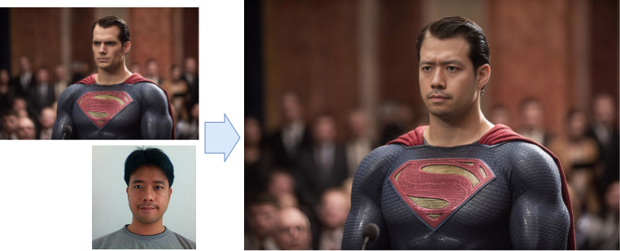
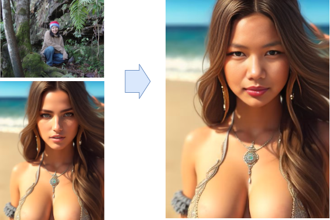

# Face swap

การเปลี่ยนหน้าด้วย AI ทำให้งานติดต่อหน้าคนทำได้รวดเร็วมาก ถ้าใช้ Photo Shop หรือ Gimp กว่าจะปรับแสงสีโทนให้เข้ากัน ด้วยวิธีเดิมๆจะกินเวลามาก  ตอนนี้เริ่มมีเครื่องมือ AI มาช่วยงานกราฟฟิกค่อนข้างมาก สำหรับมือใหม่หรือมืออาชีพ ก็ควรจะปรับตัวตามให้ทัน

## เครื่องมือ

- [Roop](https://github.com/s0md3v/roop) เลิกพัฒนาแล้วใช้ผ่าน Python
- [roop for StableDiffusion](https://github.com/s0md3v/sd-webui-roop) พัฒนาจาก Roop เป็น extension ของ Stable Diffusion WebUI 
- [ReActor for Stable Diffusion](https://github.com/Gourieff/sd-webui-reactor)  พัฒนาจาก Roop เป็น extension ของ Stable Diffusion WebUI ไม่มี NSFW filter (uncensored)

## ReActor for Stable Diffusion

เลือกใช้ ReActor เพราะอัปเดตสม่ำเสมอและยืดหยุ่นในการใช้งานมากว่า 

### ติดตั้ง ReActor
- ติดตั้ง Stable Diffusion WebUI 
- สำหรับ Windows ติดตั้ง VS Code Community Edition เพื่อใช้คอมไพล์บางคอมโปเน้นที่จำเป็น
- Extensin/Avaliable กดปุ่ม "Load From:"  ค้นหา ReActor แล้วกด Install
- รอซักครู่ให้มันติดตั้งให้เสร็จก่อนใช้งาน

## อ่านเพิ่ม

- [NEW Face Swapping Method in Stable Diffusion (ReActor Extension)](https://www.youtube.com/watch?v=JFq-JcgsAS8)