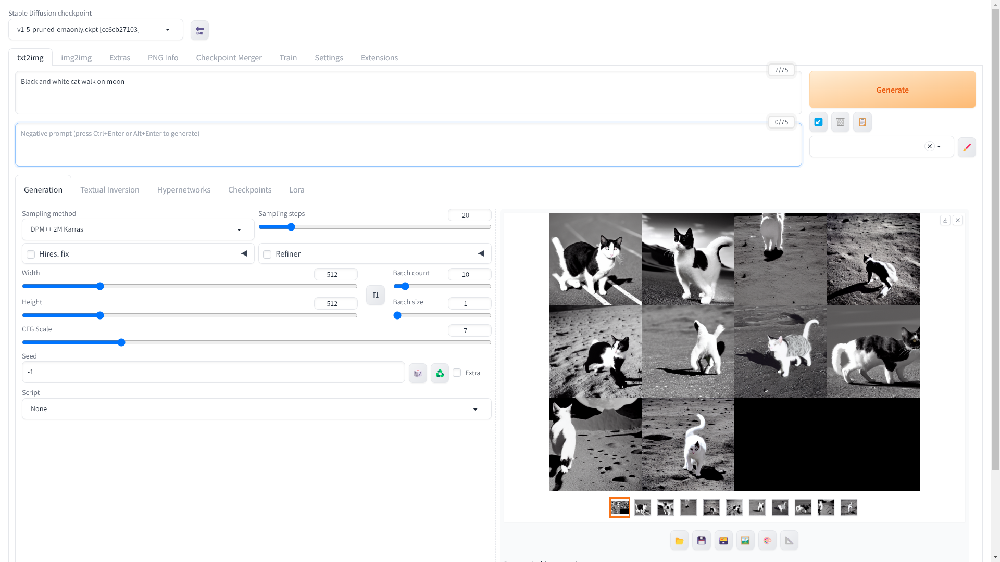
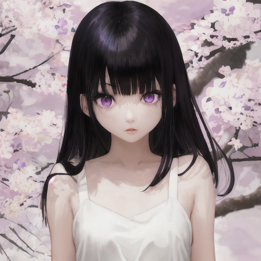
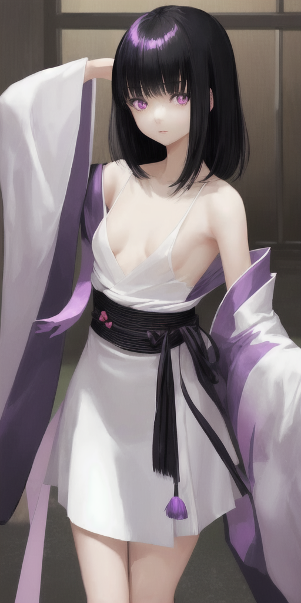
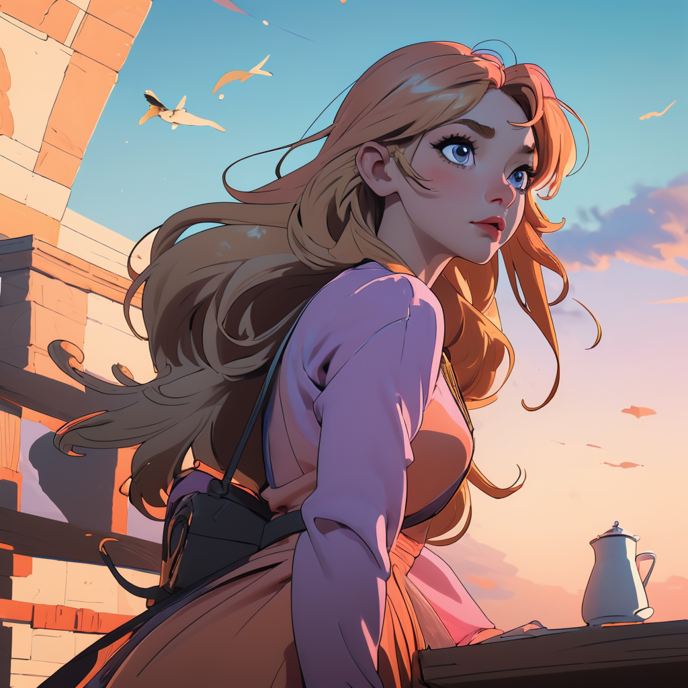

## Stable Diffusion WebUI 

[](https://youtu.be/W1J57mCE4vg "Install Stable Diffusion WebUI")


[Stable Diffusion WebUI](https://github.com/AUTOMATIC1111/stable-diffusion-webui) เป็น Web App ตัวหนึ่งที่นิยม ติดตั้งใช้งานบนเครื่องส่วนตัวได้ง่าย รองรับ Windows, macOS, Linux 

การตั้งค่าส่วนใหญ่จะแก้ตัวแปรแวดล้อม 
[COMMANDLINE_ARGS](https://github.com/AUTOMATIC1111/stable-diffusion-webui/wiki/Command-Line-Arguments-and-Settings)
ดูที่ไฟล์ webui-user
ในวินโดว์จะเป็น webui-user.bat ใน linux จะเป็น webui-user.sh ตัวอย่างการตั้งค่า
ถ้า[การ์ดจอมีแรมน้อย](https://techtactician.com/stable-diffusion-low-vram-memory-errors-fix/#how-to-run-stable-diffusion-with-low-vram
) เช่นแค่ 2GB ให้ใส่ค่า --lowvram ตัวอย่างใน webui-user.bat
```
set COMMANDLINE_ARGS="--lowvram"
```
CPU Intel (ไม่มี GPU) แนะนำให้ใช้ 
["Stable Diffusion web UI with OpenVINO™ Acceleration"](https://github.com/openvinotoolkit/stable-diffusion-webui?tab=readme-ov-file#stable-diffusion-web-ui-with-openvino-acceleration) 
ในไฟล์ webui-user.sh เป็นดังนี้
```
export COMMANDLINE_ARGS="--skip-torch-cuda-test --precision full --no-half --port 3000 --listen"
```

บน Linux ถ้าขึ้นข้อความนี้ "Cannot find TCMalloc (improves CPU memory usage)" ให้ติดตั้ง google-perftools
```
sudo apt install --no-install-recommends google-perftools
```
เวลาเรียกใช้งานจะเรียกคนละไฟล์ตามระบบปฎิบัติการ
- Windows: webui-user.bat
- Linux: webui.sh

### การตั้งค่า  Generation
- Prompt: ใส่วงเล็บเพื่อเน้น คำอธิบายนั้น
- Sampling steps: ขั้นต่ำ 20 steps. ให้เพิ่มขึ้นถ้าภาพไม่ชัด.
- Width/Height: ขนาดเริ่มต้น 512×512 pixels. ปรับให้ใหญ่ตามต้องการ
- CFG scale: ปกติตั้งไว้ 7. ให้เพิ่มถ้าต้องการให้เชื่อฟัง prompt มากขึ้น.
- Seed value: -1 จะสุ่มการสร้างภาพ กำนดเลขที่ต้องการจะได้ภาพเดิมตอนสร้างใหม่.

ถึงจะใช้ Prompt เดียวกัน ขนาดภาพและ seed ก็มีผลต่อการสร้างภาพ
```
Japanese girl, black hair with bangs, thin, small breasts, white dress, purple eyes.
Steps: 20, Sampler: DPM++ 2M Karras, CFG scale: 7, Seed: 520769746, Size: 512x512, Model hash: d7465e52e1, Model: ghostmix_v12, Version: 1.6.0
```


ขนาด 512x1024 seed เป็นคนละค่า



- Batch Count จำนวนรอบต่อไปของการประมวลภาพครั้ง
- Batch Size จำนวนภาพที่สร้างขึ้นแบบขนาน(ในเวลาเดียวกัน) ถ้าหน่วยความจำน้อยให้ใช้ Size น้อยแต่เพิ่ม Count แทน


## ตัวอย่างอื่นๆ



ภาพออกมาดูดีแต่ไม่ค่อยได้ตามที่ต้องการเท่าไหร่
```
(best quality, masterpiece), Golden-haired, girl, in the sky , Evening time, with wing, ware pink dress
Negative prompt: (worst quality, low quality, letterboxed)
Steps: 40, Sampler: DPM++ SDE Karras, CFG scale: 8, 
Seed: 950747716, Size: 512x512, Model hash: e8d456c42e, 
Model: toonyou_beta6, Denoising strength: 0.35, Hires upscale: 2, 
Hires steps: 14, Hires upscaler: R-ESRGAN 4x+ Anime6B, Version: 1.6.0
```

## Extension
- [ReActor](./face-swap.md) ในเปลี่ยนหน้า ทำได้รวดเร็วและค่อนข้างแนบเนียนเลย
