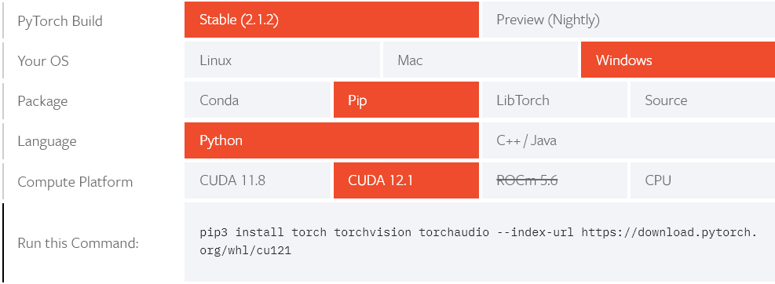
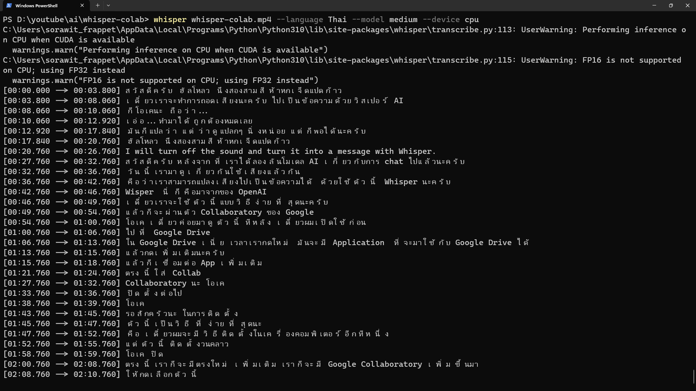

# Whisper

[Whisper](https://github.com/openai/whisper) เป็นโมเดลที่รู้จำคำพูดที่ได้รับการฝึกฝนบนชุดข้อมูลขนาดใหญ่ที่มีเสียงที่หลากหลาย รองรับหลายภาษา ตรวจและระบุภาษาได้ สามารถแปลเป็นภาษาอังกฤษได้ ในวีดีโอแสดงการถอดเสียงภาษาไทยที่อัดเอง เป็นข้อความทำได้ค่อนข้างดี ได้ลองแปลงเป็นภาษาอังกฤษก็พอใช้ได้ แต่ยังไม่ค่อยถูกต้องนัก แนะนำให้ใช้โมเดล medium ขึ้นไป

## ติดตั้งบน Colaboratory(Colab) 
Colab ทำให้เราเรียกใช้  Python ในเบราว์เซอร์ ไม่ต้องตั้งค่าใดๆ ใช้ง่ายสำหรับผู้เริ่มต้น มี GPU ให้ใช้โดยไม่มีค่าใช้จ่าย ในวีดีโอจะเรียกใช้งานผ่าน  Google Drive เพื่อรัน Whisper

ดูวิธีการทำในวีดีโอ

[](https://youtu.be/6q0EJq1ArPs "ถอดเสียงเป็นข้อความด้วย Whisper บน Colab")

โค้ดที่ใช้

``` bash
# ติดตั้ง
pip install git+https://github.com/openai/whisper.git 
sudo apt update && sudo apt install ffmpeg
## เรียกใช้
whisper sound.mp3 --language Thai --model medium --task translate
```

## ติดตั้งบนวินโดว์

Whisper ต้องการ VRAM 4GB เพื่อใช้งานโมเดลแบบ medium แต่โน้ตบุ๊กผมมี 2GB ถ้าใช้ CPU แทนจะช้าและทำงานอื่นไม่ได้ ลองถอดเสียงเป็นข้อความของไฟล์วีดีโอ HVC(H.265) ขนาด ประมาณ 15 นาทีขนาด 70MB ใช้เวลาหลายชั่วโมงเลย ในเวปจะแสดงขนาดโมเดลให้[เหมาะสมกับ VRAM](https://github.com/openai/whisper#available-models-and-languages)


การติดตั้งแนะนำให้ดูว่าขณะนี้ Python, PyTorch และ Whisper เข้ากันได้ที่เวอร์ชั่นอะไร รายละเอียดการติดตั้งดูได้[ที่นี้](https://github.com/openai/whisper?tab=readme-ov-file#setup) คำอธิบายด้านล่างนี้เป็นของวินโดว์
- ติดตั้ง [Python](https://www.python.org/) สำหรับวินโดว์ให้ใช้เวอร์ชั่น 3.8-3.10 เนื่องจาก [PyTorch](https://pytorch.org/get-started/locally/) บนวินโดว์รองรับเฉพาะรุ่นนั้น สำหรับระบบปฎิบัติการอื่นลงรุ่นใหม่กว่าได้
- ติดตั้ง [PyTorch](https://pytorch.org/get-started/locally/) เลือกกระบบปฎิบัติการ และค่าอื่นๆให้เหมาะสม ตรง CUDA ตรวจสอบการ์ดจอที่ใช้ว่ารองรับเวอร์ชั้นไหน ถ้าไม่มีให้เลือก CPU


- ติดตั้ง ffmpeg สำหรับผู้ใช้วินโดว์ให้[ติดตั้งผ่าน Chocolatey](https://chocolatey.org/install) แล้วเรียก
```
choco install ffmpeg
```
- ติดตั้ง command line ของ whisper 
```
pip install -U openai-whisper
```


``` bash 
## ใช้ CPU ในการประมวล
whisper whisper-colab.mp4 --language Thai --model medium --device cpu
## ใช้ GPU VRAM 2GB ใช้โมเดล small
whisper whisper-colab.mp4 --language Thai --model small
```

เนื่องจากเสียงของผมเองค่อนข้างฟังยากอยู่ ต้องใช้โมเดลที่ดีในการถอดความ
โมเดล medium มีความถูกต้องสูง แต่ใช้เวลาหลายชั่วโมง



ที่ VRAM 2GB รันแบบ small และใช้ GPU ทำงานได้เร็วกว่ามาก แต่ข้อความผิดหลายคำ


