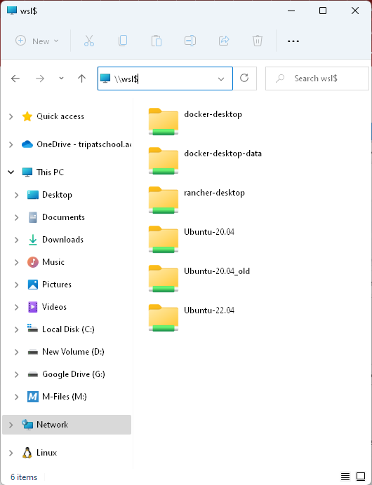
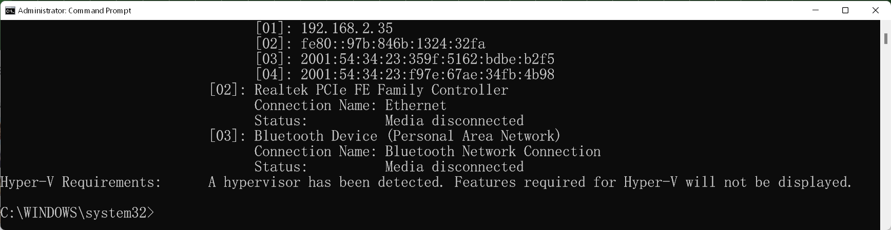

# Docker

โปรแกรมเซิร์ฟเวอร์แบบ Linux มักจะรองรับ Container เกือบหมดแล้ว  Docker ก็เป็นตัวหนึ่งที่นิยมใช้ นักพัฒนาควรจะต้องรู้และเข้าใจ
มันจะลดปัญหาต่างๆได้มาก โปรแกรมวินโดว์มีทำเป็น Container เหมือนกันแต่ไม่ค่อยนิยมนัก ปัจจุบันวินโดว์สามารถใช้ Linux ผ่าน WSL โดยไม่จำเป็นต้องรัน VM Linux ทั้งตัว ทำให้ลดการใช้ทรัพยากรได้มาก ให้ดูวีดีโอในหัวข้อที่เกี่ยวกับ WSL ถ้าพูดถึง WSL หมายจะหมายถึง WSL2 รองรับวินโดว์ 10/11 รุ่น Pro/Home สำหรับวินโดว์เซิร์ฟเวอร์จะมี [Docker](https://www.dell.com/support/kbdoc/en-th/000201261/docker-containers-on-windows-server-2022-101) รุ่นเฉพาะ หรือจะรัน Linux บน Hyper-V ก็ได้ 

## ติดตั้ง

ตัวอย่างติดตั้งบนวินโดว์ 10 ใช้กับ Docker Desktop

[](https://www.youtube.com/watch?v=8g_GwM60MaU&list=PLWMbTFbTi55P6Vzv9a-un9oFZY-PwMj98 "ติดตั้ง Docker ร่วมกับ WSL2 (Win10)")

ตัวอย่างติดตั้งบนวินโดว์ 11 Home ติดตั้ง Docker แบบ Linux เพราะ WSL รุ่นใหม่รองรับ systemd ของ Linux แต่จะใช้งานผ่าน Power Shell ไม่ได้แนะนำให้ติดตั้ง Docker Desktop จะดีกว่า

[](https://www.youtube.com/watch?v=8Tb1qB_VZ-s&list=PLWMbTFbTi55P6Vzv9a-un9oFZY-PwMj98&index=35 "WSL2 Docker(Systemd) บน Windows 11 Home")


วิธีการติดตั้งบน Linux [ดูลิงค์นี้](https://docs.docker.com/engine/install/) ถ้าต้องการติดตั้งแบบรวดเร็วบน Ubuntu ทำตามนี้

``` bash
curl -fsSL https://get.docker.com -o get-docker.sh
sudo sh ./get-docker.sh
sudo usermod -aG docker username
```

## เริ่มใช้งาน

เมื่อรันคำสั่ง Linux ได้แล้วก็ใช้งานได้เหมือนบน Linux ทั่วไปเลย บนวินโดว์สามารถเข้าถึงไฟล์บน WSL ได้ด้วย "\\wsl$"



วิธีการใช้งานเบื่องต้นให้ลองทำตามนี้ หัวข้ออื่นๆดูได้ Play List เดียวกันกับวีดีโอที่ใช้ การใช้งาน Docker ผ่าน WSL จะใช้งานไม่ต่างกันทั้ง Linux และวินโดว์

[](https://www.youtube.com/watch?v=ntLLCJk9LyY&list=PLWMbTFbTi55P6Vzv9a-un9oFZY-PwMj98&index=3 "Docker in WSL2: เริ่มต้นใช้งาน Docker บน WSL2")


คำสั่งพื้นฐาน
``` bash
docker run -d nginx          # รันคอนเทนเนอร์โดยใช้อิมเมจ nginx
docker ps                    # ดูว่ามี container อะไรรันอยู่บ้าง
docker stop container_id     # หยุดการทำงาน container
docker start container_id    # เริ่มการทำงานต่อจากที่หยุดไป
docker images                # แสดงรายการอิมเมจในเครื่อง
docker image prune           # ลบอิมเมจที่ไม่ได้ใช้งาน
docker attach container_id # เชื่อมต่อคอนโซลใช้งานของคอนเทนเนอร์นั้น กด ctrl+p ตามด้วยกด q เพื่อออก
docker login                 # เข้าใช้งาน docker registry
docker loout                 # ลงชื่อออกจาก docker registry
docker search ubuntu         # ค้นหาอิมเมจ ubuntu
docker pull nginx            # ดึงอิมเมจมาที่เครื่อง
docker rm container_id       # ลบ container ออก
```
ควรดูหัวข้อ [docker compose](../docker-compose/) เพิ่ม

## ปัญหา WSL2

- ติดตั้ง WSL2 ไม่ได้ ลองดูว่าวินโดว์อัปเดตไม่ได้หรือเปล่า (อาจจะให้ร้านลงมาแล้วปิดอัปเดต) ควรอัปเดตเป็นรุ่นล่าสุดก่อน(21H2 หรือสูงกว่า) 
- CPU อาจจะไม่รองรับ(รุ่นใหม่ควรรองรับหมดแล้ว) ฟีเจอร์ Virtualization บางอย่างลองดูใน task manager

- ลองรันคำสั่ง systeminfo 


- CPU รองรับแต่ Bios ไม่ได้เปิด Virtualization ให้เข้าไปใน Bios แล้วให้เปิด Virtualization Technology, VT-D, AMD-V, SVM Mode ในแต่ละรุ่นอาจจะใช้ชื่อต่างกัน ลองดูตัวอย่างของ 
[ASUS](https://www.asus.com/support/FAQ/1045141/), [MSI](https://th.ldplayer.net/blog/108.html)

## เพิ่มเติม
- [การใช้งาน Docker บน production](./docker-in-production.md)
- [การใช้งาน docker compose](../docker-compose/)
