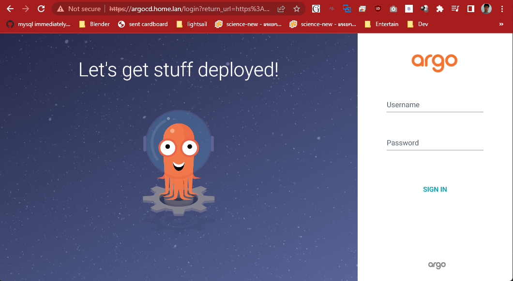

# ArgoCD
เป็นเครื่องมือ GitOps สำหรับทำ Continuous Celivery(CD) บน Kubernetes(K8s) โดยคอยดูการเปลี่ยนแปลงของ Git ในวีดีโอใช้ไฟล์ yaml จาก [myweb](../myweb/) ซึ่งเป็นตัวอย่างการ deploy nginx ขึ้น K8s จากวีดีโอที่แล้ว 

[](https://www.youtube.com/watch?v=c7sSQLuhht0&list=PLWMbTFbTi55OtdeRGeerLFQSTw61cEGni&index=11 "Continuous continuous แบบหมูๆด้วย ArgoCD")

## Install
```
kubectl create namespace argocd
kubectl apply -n argocd -f https://raw.githubusercontent.com/argoproj/argo-cd/stable/manifests/install.yaml
```
หลังติดตั้งแล้วเรายังไม่สามารถเข้าถึง UI ของโปรแกรมได้ ในตัวอย่างนี้จะเซ็ต Intress เพื่อ
เข้าถึง ArgoCD ในตัวอย่างใช้ k3s ซึ่งเป็น traefik ให้[ก็อปปี้คอนฟิก](https://argo-cd.readthedocs.io/en/stable/operator-manual/ingress/#traefik-v22)
มาแก้ให้เป็น domain ของเรา หลังแก้แล้วจะเป็นดังนี้

```
apiVersion: traefik.containo.us/v1alpha1
kind: IngressRoute
metadata:
  name: argocd-server
  namespace: argocd
spec:
  entryPoints:
    - websecure
  routes:
    - kind: Rule
      match: Host(`argocd.home.lan`)
      priority: 10
      services:
        - name: argocd-server
          port: 80
    - kind: Rule
      match: Host(`argocd.home.lan`) && Headers(`Content-Type`, `application/grpc`)
      priority: 11
      services:
        - name: argocd-server
          port: 80
          scheme: h2c
  tls:
    certResolver: default
```

เมื่อเข้าเวป https://argocd.home.lan/ มันจะขึ้น ERR_TOO_MANY_REDIRECTS เพราะว่า
ArgoCD พยายาม redirect จาก http ไป https โดย Reverse proxy (Ingress Traefik) ก็ redirect เหมือนกัน
ให้แก้คอนฟิกด้วยคำสั่งด้านล่างแล้วใส่ "--insecure" เพิ่มเข้าไป จะมีอีกวิธีแก้อีกวิธีหนึ่งคือเพิ่มผ่าน configMap (เราไม่ได้ใช้วิธีนี้)
```
kubectl -n argocd edit deployments.apps argocd-server
```
มันจะเรียก editor กรณีบน Linux จะเป็น vi ใช้ยากหน่อย ให้เลื่อน curser ไปอยู่หลัง argocd-server กดปุ่ม "a" (คำสั่ง append)
แล้วเพิ่ม "- --insecure" ลงไปให้เหมือนในด้านล่าง กด ESC แล้วกด ":" เพื่อกลับมารับคำสั่งแล้วกด "wq"(คำสั่ง write and quit) 

 ``` yaml
      containers:
      - command:
        - argocd-server
        - --insecure
        env: 
        - name: ARGOCD_SERVER_INSECURE
          valueFrom:
            configMapKeyRef:
              key: server.insecure
              name: argocd-cmd-params-cm
              optional: true
 ```
Linux แบบ Text Mode ใช้ nano แทน vi ได้ หรือ macOS ใช้ Visual Studio Code เปิดคอนฟิกได้
```bash
export KUBE_EDITOR="/usr/bin/nano"
export KUBE_EDITOR='open -a "Visual Studio Code" --wait'
```
วินโดว์ใช้ Visual Studio Code ทำแบบนี้
```
KUBE_EDITOR=code -w
```


เมื่อเข้าเวป https://argocd.home.lan/


ยูสเซอร์ admin รหัสผ่านอยู่ใน secret ชื่อ argocd-initial-admin-secret ให้ decode ด้วย base64 ก่อนใช้งานทำตามดังภาพ

``` bash
oom@Ubuntu22:~/k8s/argo-cd$ kubectl get secret argocd-initial-admin-secret -n argocd -o json
{
    "apiVersion": "v1",
    "data": {
        "password": "Sm1DWjJCbzEzV2RrbEpxNA=="
    },
    "kind": "Secret",
    "metadata": {
        "creationTimestamp": "2023-02-10T20:14:17Z",
        "name": "argocd-initial-admin-secret",
        "namespace": "argocd",
        "resourceVersion": "4111400",
        "uid": "037d3223-aad7-415a-adb2-a636c186a0bb"
    },
    "type": "Opaque"
}
oom@Ubuntu22:~/k8s/argo-cd$ echo -n "Sm1DWjJCbzEzV2RrbEpxNA==" | base64 -d
JmCZ2Bo13WdklJq4oom@Ubuntu22:~/k8s/argo-cd$ 
```
จะได้ JmCZ2Bo13WdklJq4 เป็นระหัสผ่าน เมื่อเข้าระบบได้ก็ให้เปลี่ยนรหัสเป็นอย่างอื่น

ให้เซ็ตค่าตามวีดีโอ โดยใช้ git repository ของตัวเองควรทดสอล deploy แบบ manual ให้ผ่านก่อนนะครับ

# Note
เวลาแก้คอนฟิกแล้วมันไม่ค่อยโหลดใหม่ให้ restart argocd-server
```
k -n argocd rollout restart deployment argocd-server
```
วีดีโอนี้ทำให้ดูแบบเข้าใจง่ายไม่ซับซ้อน ยังมีอีกหลายฟีเจอร์ที่ไม่ได้แสดงให้ดู แนะนำให้คลิ้กเข้าไปดูในแต่ละไดอะแกรม 


