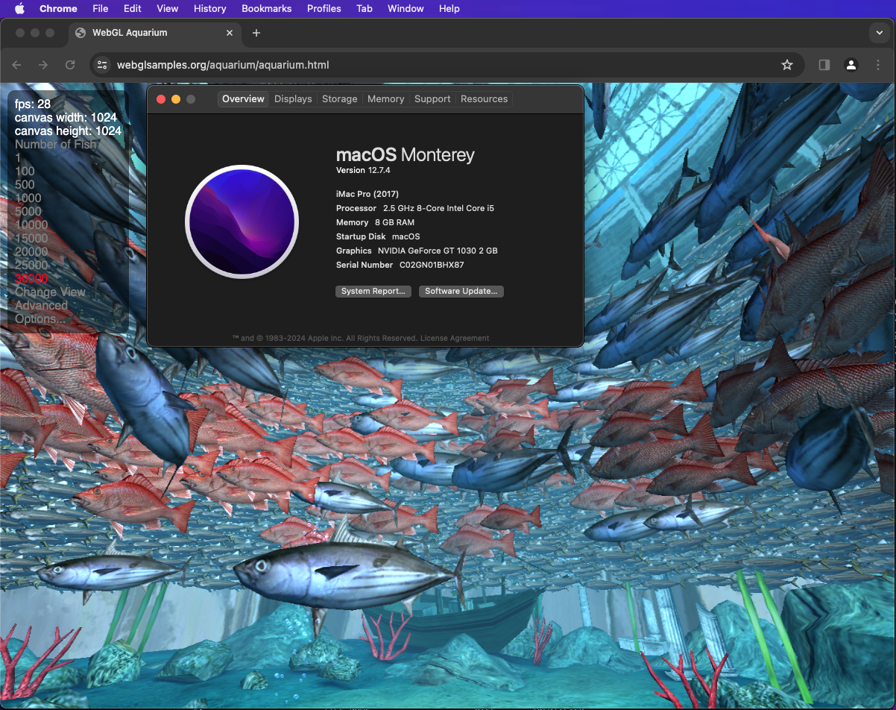
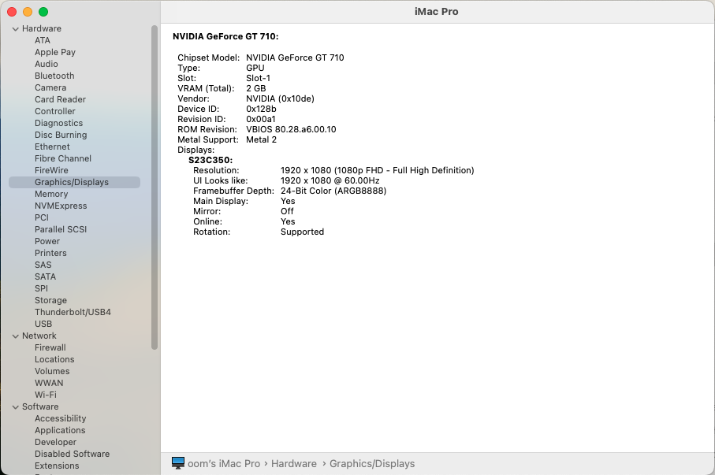
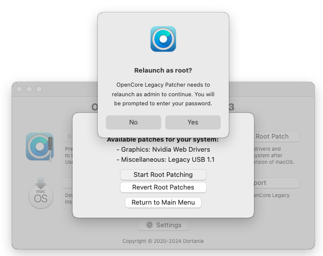

# GPU Passthrugh
สามารถนำมาทำ MultiSeat โดยทำการส่ง คีย์ดบอร์ด เมาส์ การ์ดจอเข้าไปใน VM ตัว Proxmox สามารถตั้งค่าได้ง่าย ติดตั้ง macOS, Windows หรือ Linux บน VM ให้เรียบร้อยก็จะเริ่มทำได้
การ์ดจอ(เลือก All Functions, ROM-Bar, PCI-Express) 

## Linux 
ทำได้ง่ายยังไม่พบปัญหา แนะนำให้ใช้ POP OS เพราะมีไดร์เวอร์การ์ดจอมาในตัว

## Windows
ทำได้ง่าย แต่มีปัญหาเสียงกระตุกและแตก ต้องตั้งค่า 
- [MSI]

## MacOS
การ์ดจอไม่เลือก Primary GPU, PCI-Express Energy Saver ควรปิดไม่ให้ Sleep ให้ปิดหน้าจอพอ
 โปรแกรมที่ต้องจำเป็นต้องใช้
- [OCAuxiliaryTools]()
- [OpenCore-Patcher]()

มีปัญหาไดร์เวอร์ Nvidia เนื่องจากทาง Nvidia ไม่ทำไดร์เวอร์การ์ดจอให้ macOS รุ่นใหม่แล้ว ส่วน ตอนนี้ที่รองรับที่ดีที่สุดก็เป็นรุ่น 
- Kepler ([GT6XX GT7XX, Tesla K80, Quadro K510M K610M](https://www.techpowerup.com/gpu-specs/?architecture=Kepler+2.0&sort=generation))
รองรับ Sonoma 14.4.1 (Metal 2) ใช้ Kepler Patch

Sonoma ให้ตั้งค่าใน NVRAM ตามนี้
boot-args : amfi_get_out_of_my_way=0x1
csr-active-config: EF0F0000

- Pascal ([GT 10xx, GTX 10xx, Quadro Px000,Quadro Px200, Tesla Pxx ฯลฯ](https://www.techpowerup.com/gpu-specs/?architecture=Pascal&sort=generation))  รองรับ Sonoma 14.4.1 ใช้  WebDriver (รองรับ OpenGL ,เสียงไม่ออก)

| Param    | Detail |
| -------- | ------- |
| amfi_get_out_of_my_way=0x1 | Disables Library Validation |
| ngfxcompat=1 | Forces compatibility via WhateverGreen|
| ngfxgl=1 | Forces OpenGL rendering
| nvda_drv_vrl=1 | Enable Web Drivers

csr-active-config ใช้ 030A0000 |

AMD รองรับบางรุ่น (ตอนนี้ยังทำไม่ได้)

## ดูเพิ่มเติม

- [WebDriver](https://elitemacx86.com/threads/how-to-enable-nvidia-webdrivers-on-macos-big-sur-and-monterey.926/)

