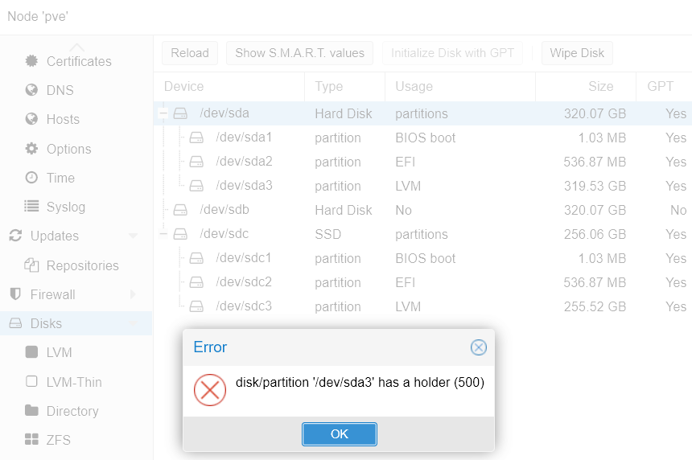

# Proxmox Storage

## เพิ่มดีสก์และเลือกใช้ Storage ใน Proxmox
 
[](https://youtu.be/KPzflWC_TQg "เพิ่มดีสก์และเลือกใช้ Storage ใน Proxmox")

เราสามารถจัดการดีสก์ สร้างได้หลาย File System จะทำ RAID ก็ได้ 


# ลบ Disk ที่เคยลง Proxmox มาก่อนจาก Proxmox



ผมอัปเกรดเครื่องเป็น SSD(mSATA) แล้วติดตั้ง proxmox ใหม่บน SSD ส่วนดีสก์ SATA เดิมจะลบด้วย Proxmox GUI ไม่ได้ขึ้น Error ตามภาพ ต้องใช้คำสั่ง wipefs เพื่อลบแล้ว reboot หนึ่งที
( [ที่มา](https://www.reddit.com/r/Proxmox/comments/oosi8m/deleting_old_proxmox_boot_drive_from_new_proxmox/) )
```
wipefs /dev/sda
```
