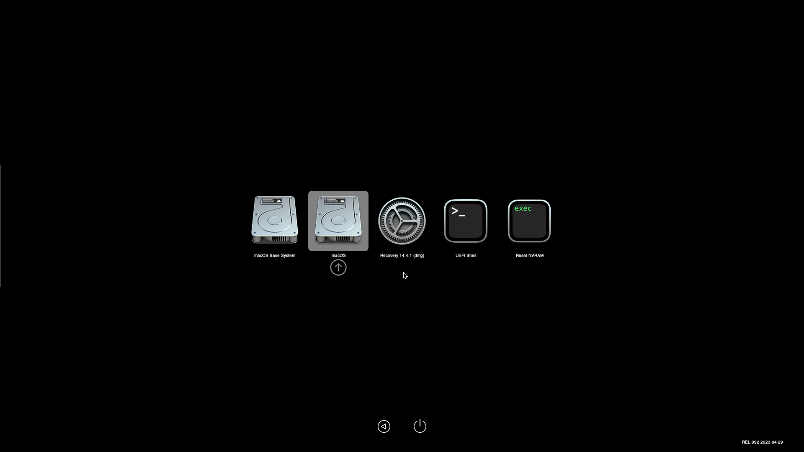

```
apt install git dmg2img
git clone https://github.com/kholia/OSX-KVM.git
cd cd OSX-KVM
```

เลือก 
```
./fetch-macOS-v2.py
1. High Sierra (10.13)
2. Mojave (10.14)
3. Catalina (10.15)
4. Big Sur (11.7)
5. Monterey (12.6)
6. Ventura (13) - RECOMMENDED
7. Sonoma (14)

Choose a product to download (1-6): 6
```


```
dmg2img -i BaseSystem.dmg Sonoma-Recovery.img
mv Sonoma-Recovery.img /var/lib/vz/template/iso/

```
upload OpenCore-v21.iso


## Create VM 
- General: Name Sonoma
- OS: ISO Image OpenCore-v21.iso, Type Other
- System: Machine Q35, BIOS OVMF (UEFI), Choose UEFI Storage, Pre-Enroll keys (uncheck), Qemu Agent
- Disk: VirtIO Block,Size 64GB
- CPU: Core 4, Type host
- Memory 8192 (uncheck Balloon Device)
- Network VirtIO(paravirtualized)


แก้ /etc/pve/qemu-server/101.conf
```
ide0: local:101/vm-101-disk-1.raw,cache=unsafe,size=3142252K
ide2: local:101/vm-101-disk-2.raw,cache=unsafe,size=150M
args: -device isa-applesmc,osk="ourhardworkbythesewordsguardedpleasedontsteal(c)AppleComputerInc" -smbios type=2 -device usb-kbd,bus=ehci.0,port=2 -global nec-usb-xhci.msi=off -global ICH9-LPC.acpi-pci-hotplug-with-bridge-support=off -cpu host,vendor=GenuineIntel,+invtsc,+hypervisor,kvm=on,vmware-cpuid-freq=on
```




brew install qemu

Passthrugh PCI GT 710 เข้าไป ใช้เวลานานมากตอนบูต


remove this
```
ide0: SATA-DATA:iso/Monterey-Recovery.img,cache=unsafe,size=3144712K
ide2: SATA-DATA:iso/OpenCore-v21.iso,cache=unsafe,size=150M
```

- Ventura 
https://www.youtube.com/watch?v=X-_9eKyNxMU

https://forum.proxmox.com/threads/gpu-passthrough-on-proxmox-ve-macos-monterey-part-04x04.140579/


- [EFI](https://ikip.site/t/2)


- [The Definitive Guide to Running MacOS in Proxmox](https://klabsdev.com/definitive-guide-to-running-macos-in-proxmox/)