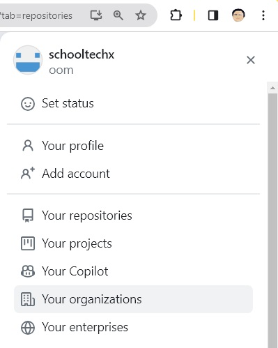
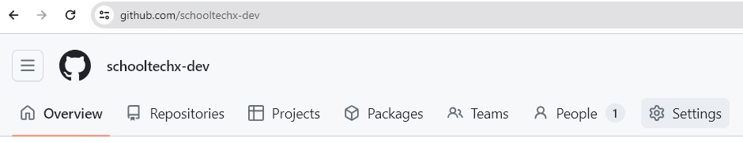
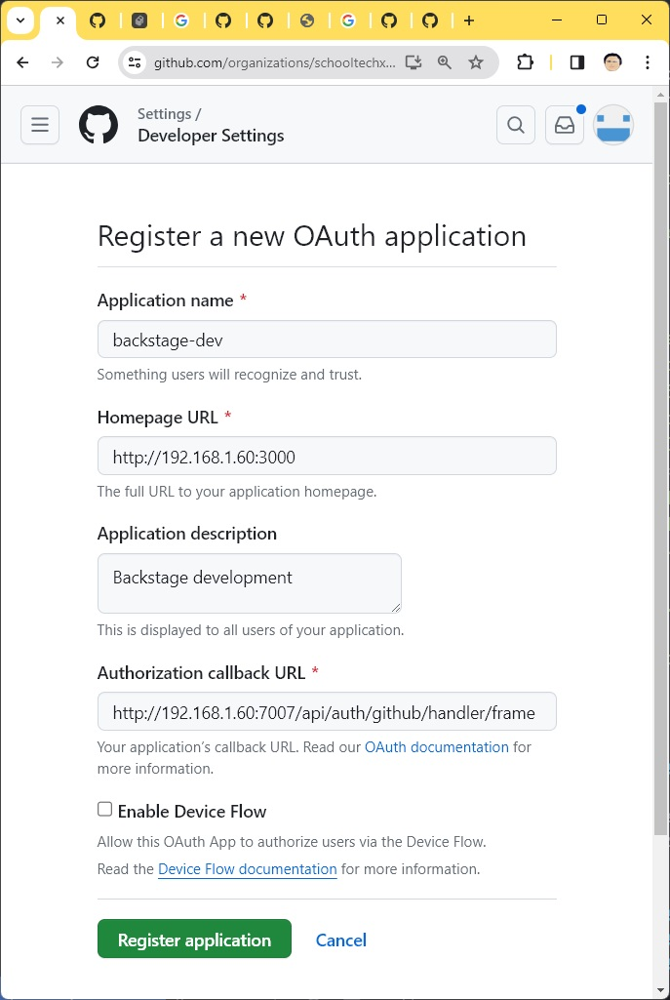

## Install Backstage
ขั้นตอนการทำเอามาจาก[เอกสารนี้](https://backstage.spotify.com/learn/standing-up-backstage/standing-up-backstage/1-intro/)

## Install Prerequisites
```
# Install docker
# Install nvm
apt install build-essential
nvm install --lts
npm i -g yarn
npx @backstage/create-app@latest
```
เปิด vscode ดูค่าตั้งต้นจะอยู่ใน app-config.yaml ไม่ต้องแก้ไข สำหรับ development และ production จะมีไฟล์ app-config.local.yaml และ app-config.production.yaml ไว้ตั้งค่า แทนที่ค่าตั้งต้นได้

## Github Setup
ให้สร้าง Organization เอาไว้แล้วสร้าง clinet_id และ secret เก็บไว้ใช้งาน

- คลิ้กที่รูป Profile บนขวาแล้วเลือก Your Organization แล้วกดปุ่ม New Organization ในตัวอย่างสร้างเป็นชื่อ "schooltech dev"

 

- ใน Organization เลือก Settings เมนูล่างซ้ายสุดตรง Developer Setting ให้เลือก OAuth App


- เลือก New Org OAuth App ในตัวอย่างนี้สร้างชื่อว่า backstage เข้าไปกดปุ่ม "Generate a new client secret"


ค่า Homepage URL และ Authorization callback ขึ้นกับ วิธีการที่ติดตั้งเช่น Development และ Production ก็ควรใช้ client ที่มีการตั้งค่าที่ต่างกันไป ในตัวอย่างเป็นของ Development 

## Setup SSO
ในตัวอย่างจะใช้ของ Github แบบ Organization (จะใช้ Personal Account ก็ได้)
ในตัวอย่างนี้จะแยก Development และ Production เพื่อให้ทำงานร่วมกันได้พร้อมกันจะแยกคอนฟิกไปที่ app-config.local.yaml และ app-config.production.yaml
นอกจากนี้ต้องแก้ไฟล์ packages/app/src/App.tsx ด้วย
แนะนำให้[อ่านจากเอกสาร](https://backstage.io/docs/auth/#adding-the-provider-to-the-sign-in-page)

## Setup PostgreSQL

[แนะนำให้ดูเอกสาร](https://backstage.spotify.com/learn/standing-up-backstage/configuring-backstage/5-config-3/)

## Setup Development

สำหรับการทดสอบใช้คำสั่ง yarn dev จะเรียกใช้ได้เลยฐานข้อมูลจะอยู่ในหน่วยความจำปิดแล้วหาย ไม่ต้องทำ Authentication ในตัวอย่างไฟล์
app-config.local.yaml เป็นการติดตั้ง่บนเซิร์ฟเวอร์ Linux 192.168.1.60 ถ้าเป็น localhost และใช้ Single Sign On ด้วย Github

```yaml
app:
  title: Scaffolded Backstage App
  baseUrl: http://192.168.1.60:3000
backend:
  baseUrl: http://192.168.1.60:7007
  listen:
    host: 192.168.1.60
  cors:
    origin: http://192.168.1.60:3000
auth:
  providers:
    github:
      development:
        clientId: ${AUTH_GITHUB_CLIENT_ID}
        clientSecret: ${AUTH_GITHUB_CLIENT_SECRET}

```
clinet_id และ secret ไม่ควรเก็บในไฟล์ ให้ใช้จากตัวแปรแวดล้อม
``` bash
export AUTH_GITHUB_CLIENT_ID=xx
export AUTH_GITHUB_CLIENT_SECRET=yyy
```

## Setup Production
ตัวอย่างนี้จะรันบน Docker Container ให้สร้าง Docker Image

``` bash
yarn build:all
yarn build-image
```
สร้างโฟลเดอร์ postgres_data หรือ docker volume เพื่อเก็บข้อมูลของ Postgres ตั้งค่า id:group ของ user ใน compose.yaml ให้ตรงกับยูสเซอร์ที่รัน docker


app-config.production.yaml
``` yaml
app:
  title: Dev Portal
  baseUrl: https://my-dev-domain.com
organization:
  name: MyCompahy co,ltd
backend:
  baseUrl: https://my-dev-domain.com
  database:
    connection:
      host: ${POSTGRES_HOST}
      port: ${POSTGRES_PORT}
      user: ${POSTGRES_USER}
      password: ${POSTGRES_PASSWORD}
auth:
  providers:
    github:
      development:
        clientId: ${AUTH_GITHUB_CLIENT_ID}
        clientSecret: ${AUTH_GITHUB_CLIENT_SECRET}
```
compose.yaml
``` yaml
# mkdir postgres_data
version: '3'
services:
  backstage:
    image: backstage
    restart: unless-stopped
    volumes:
      - ./app-config.production.yaml:/app/app-config.production.yaml
    ports:
      - "7008:7007"
    environment:
      - ORG_NAME=Frappet T
      - POSTGRES_HOST=postgres
      - POSTGRES_PORT=5432
      - POSTGRES_USER=postgres
      - POSTGRES_PASSWORD=secret
      - AUTH_GITHUB_CLIENT_ID=org_client_id
      - AUTH_GITHUB_CLIENT_SECRET=client_secret
      - TZ=Asia/Bangkok
  postgres:
    image: postgres:15.3
    user: 1000:1000
    restart: unless-stopped
    volumes:
      - ./postgres_data:/var/lib/postgresql/data
#    ports:
#      - "5432:5432"
    environment:
      - POSTGRES_PASSWORD=db_secret
      - TZ=Asia/Bangkok
    healthcheck:
      test: ["CMD-SHELL", "pg_isready -h postgres -U postgres"]
      interval: 10s
      timeout: 5s
      retries: 5
      start_period: 80s  
```

## Setup Integration
เพื่อให้ Backstage สามารถอ่านหรือเขียนข้อมูลไปยังแหล่งภายนอกได้ เช่น Github, Cloud, LDAP ฯลฯ ในตัวอย่างทั่วไปจะใช้ของยูสเซอร์ในการทำ วิธีที่ดีกว่าคือ [GitHub Apps](https://backstage.io/docs/integrations/github/github-apps/)
