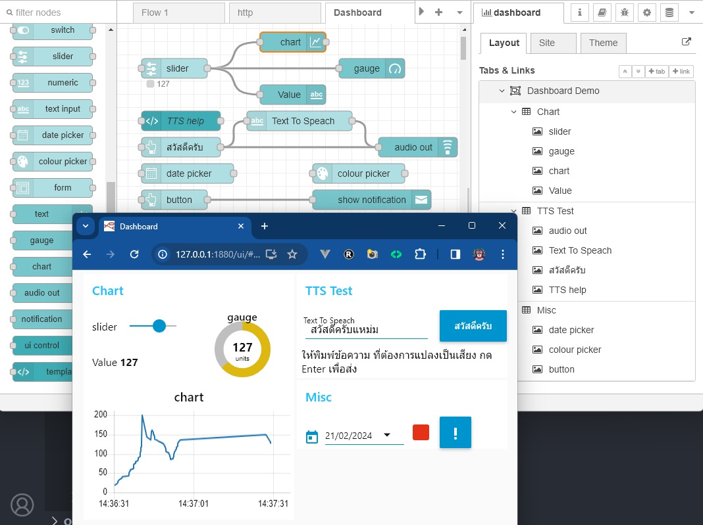
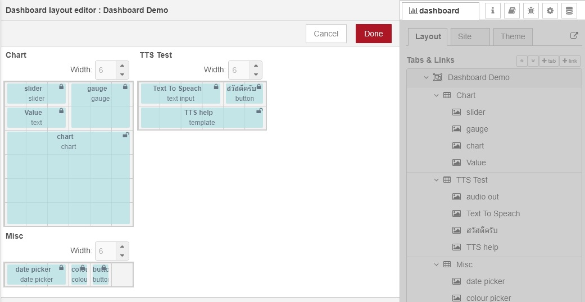

# Dashboard
เป็นหน้าเวปสำหรับแสดงผลต้องติดตั้งเพิ่ม ไปที่ Manage palette/palette/Install ติดตั้ง [node-red-dashboard](https://flows.nodered.org/node/node-red-dashboard)

- Tab เป็นการแบ่งหน้าเวปเป็นหลายๆหน้า จะมี hamburger menu (สามขีด) เพื่อแสดงและใช้เปลี่ยน Tab ในตัวอย่างจะมี Tab เดียวชื่อ Dashboard Demo
- Group เป็นกลุ่มของ UI ที่แสดงข้างใน Tab ในตัวอย่างจะมี Chart, TTS Test, Misc

- Layout สามารถกำหนดขนาดของ UI Component ให้เหมาะสมกับขนาดของ Group เพื่อการแสดงผลที่ดียิ่งขึ้น

## ดูเพิ่ม

- [Material Icons](https://fonts.google.com/icons?icon.set=Material+Icons) ใก้ก็อปปี้ไอดีของไอคอนไปใช้กับพวกปุ่มได้

- [node-red-node-ui-table](https://flows.nodered.org/node/node-red-node-ui-table)