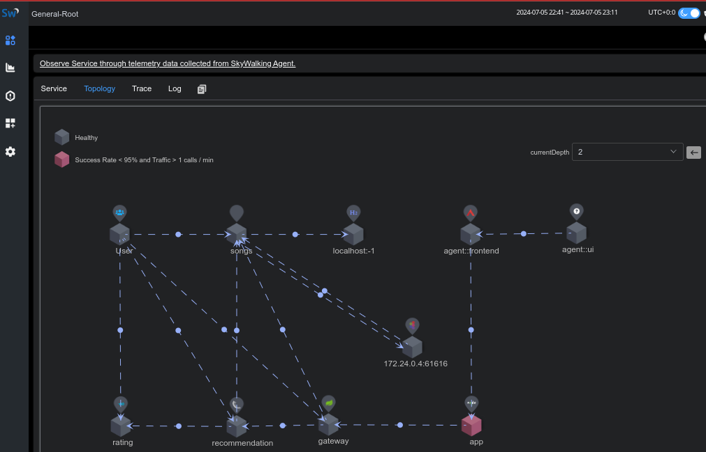
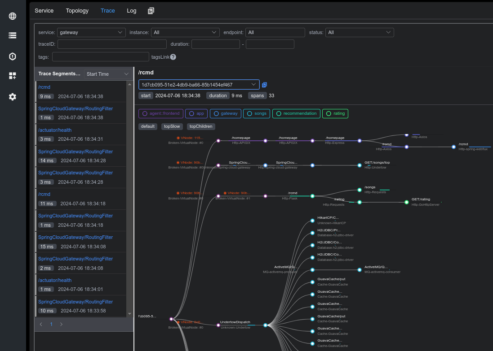

# Apache Skywalking

[SkyWalking](https://skywalking.apache.org/) 
เป็นระบบ APM (Application Performance Monitoring) แบบ Opensource. ออกแบบมาเฉพาะสำหรับ Microservice, Cloud Native และ สถาปัตยกรรมแบบคอนเทนเนอร์

มี Agent สำหรับการพัฒนาภาษาต่างๆ Java, .Net Core, PHP, NodeJS, Golang, LUA, Rust, C++, Client JavaScript และ Python

SkyWalking Observability Analysis Platform (OAP) จะให้โปรโตคอล gRPC ในการส่งข้อมูล

นอกจากคำว่า Monitoring แล้วยังอาจจะเรียกว่า Observability ด้วยซึ่งมีสามส่วน

- Logging
- Tracing
- Metric




## SkyWalking 10.x showcase

[skywalking-showcase](https://skywalking.apache.org/docs/skywalking-showcase/next/readme/) เป็น demo แสดงความสามารถของ Skywalking

เป็นตัวอย่างแอปเพลงที่ประกอบไปด้วย microservice สร้างจากหลายตัวจากหลายภาษา และคอมโปเน้นอื่นๆ จะมี load generator เพื่อจำลองกรทำงานตลอดเวลา จะใช้ Skywalking เพื่อดึงค่าต่างๆมาแสดง จะมีการเรียก docker compose หลายรายการกินเนื้อที่ RAM และใช้เวลามาก เรียกแบบน้อยที่สุดดังนี้ (ถ้าไม่กำหนด FEATURE_FAGS มันจะเรียกหลายตัว)

```bash
git clone https://github.com/apache/skywalking-showcase.git
cd skywalking-showcase
make deploy.docker FEATURE_FLAGS=single-node,agent
```
เวอร์ชั้นที่ clone มา ถ้าเรียงมางฟีเจอร์มีปัญหาว่าตัวแปร OTEL_COLLECTOR_VERSION ไม่ได้เซ็ตค่า ตัวแปรน่าจะผิดให้แก้เป็น OTEL_COLLECTOR_IMAGE_TAG ถึงจะใช้ได้
ไปที่ http://localhost:9999 จะดูได้แบบนี้


[](https://youtu.be/7d1Obv9XTvw?si=p3fmoBXbe3laoIkr "SkyWalking showcase Intro")

## Agent Node.js
ตัวอย่างการโปรแกรมด้วย Web API ด้วย Express.js ติดตั้ง Agent

```
$ npm install --save skywalking-backend-js
```
app.ts
```ts
import agent from "skywalking-backend-js"
agent.start({})
import dotenv from 'dotenv'; 
dotenv.config();
import express from 'express'
const app = express()
const port: number = Number(process.env.PORT) || 80;
app.get('/count/:count', async (req, res, next) => {
    if(req.params.count==="13") throw new Error('Uh oh!');
    res.status(200).send('The API service works fine! '+req.params.count);
});
app.listen(port, () => console.log(`Application is running on port ${port}`))
```
.env
```
PORT=3003
```


## อ่านเพิ่ม
- [Observability Pt. 1: ทำความรู้จักกับ Observability กันเถอะ](https://medium.com/kbtg-life/observability-pt-1-%E0%B8%97%E0%B8%B3%E0%B8%84%E0%B8%A7%E0%B8%B2%E0%B8%A1%E0%B8%A3%E0%B8%B9%E0%B9%89%E0%B8%88%E0%B8%B1%E0%B8%81%E0%B8%81%E0%B8%B1%E0%B8%9A-observability-%E0%B8%81%E0%B8%B1%E0%B8%99%E0%B9%80%E0%B8%96%E0%B8%AD%E0%B8%B0-5b2561bc4365)
- [Observability Pt. 2: Tracing with OpenTelemetry and Jaeger](https://medium.com/kbtg-life/observability-pt-2-tracing-with-opentelemetry-and-jaeger-a887d6e0c7ba)
- [Observability Pt. 3: Manual Tracing Instrumentation with OpenTelemetry](https://medium.com/kbtg-life/observability-pt-3-manual-tracing-instrumentation-with-opentelemetry-129a22944c19)
- [Observability Pt. 4: การเชื่อมความสัมพันธ์ระหว่าง Trace กับ Log](https://medium.com/kbtg-life/observability-pt-4-%E0%B8%81%E0%B8%B2%E0%B8%A3%E0%B9%80%E0%B8%8A%E0%B8%B7%E0%B9%88%E0%B8%AD%E0%B8%A1%E0%B8%84%E0%B8%A7%E0%B8%B2%E0%B8%A1%E0%B8%AA%E0%B8%B1%E0%B8%A1%E0%B8%9E%E0%B8%B1%E0%B8%99%E0%B8%98%E0%B9%8C%E0%B8%A3%E0%B8%B0%E0%B8%AB%E0%B8%A7%E0%B9%88%E0%B8%B2%E0%B8%87-trace-%E0%B8%81%E0%B8%B1%E0%B8%9A-log-97a834958144)
- [Observability Pt. 5: Observability as Non-Functional Requirements](https://medium.com/kbtg-life/observability-pt-5-observability-as-non-functional-requirements-ccf6fc507ab7)
