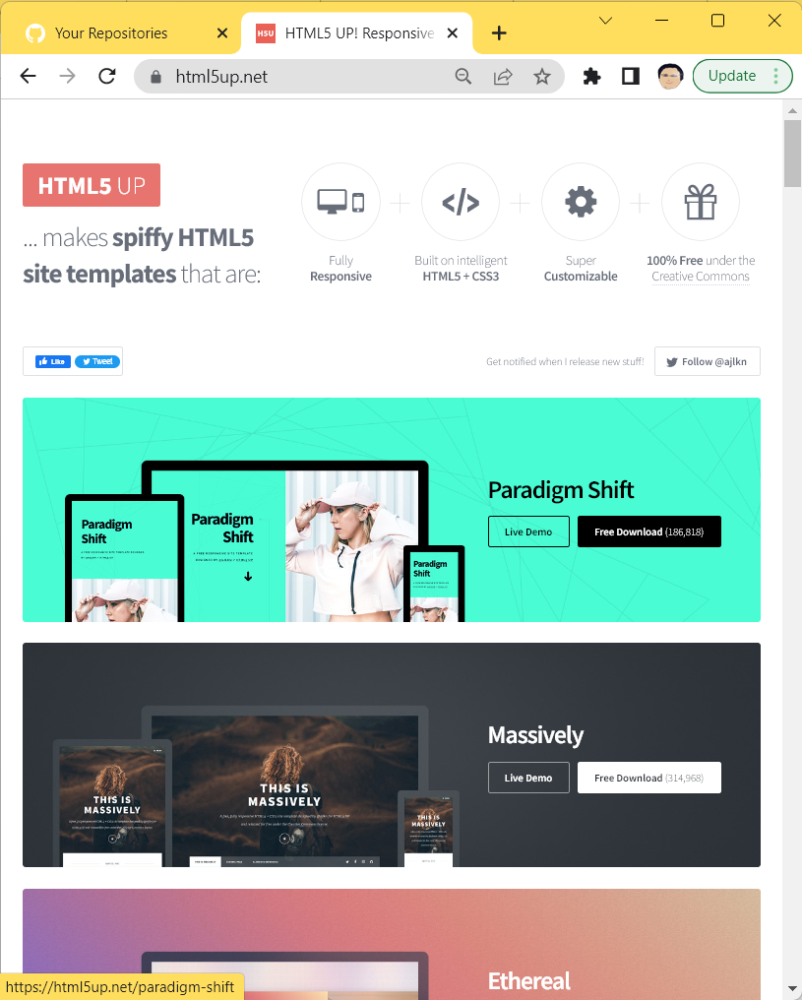
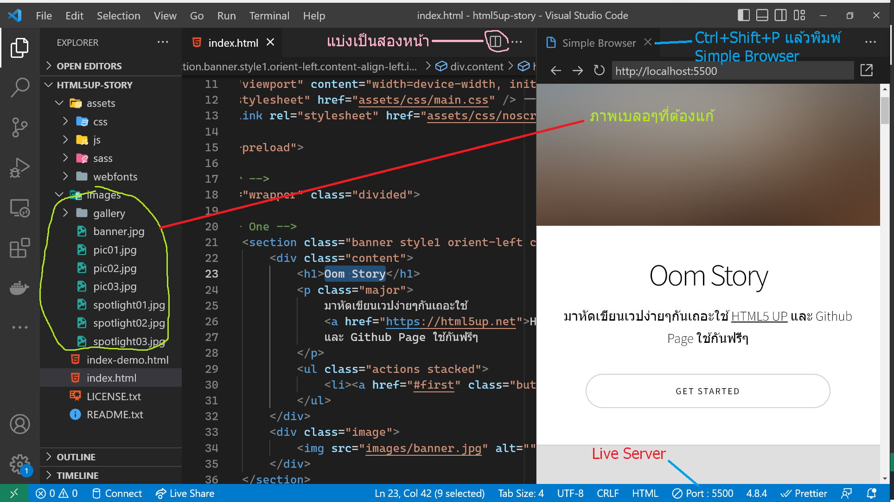
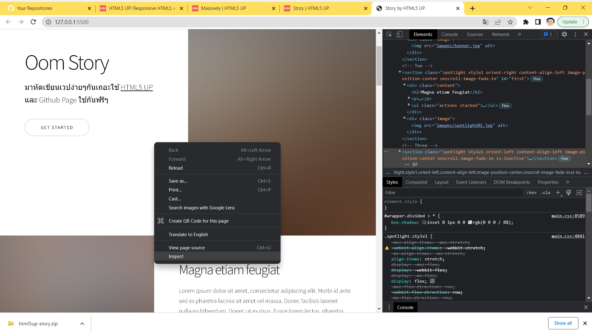
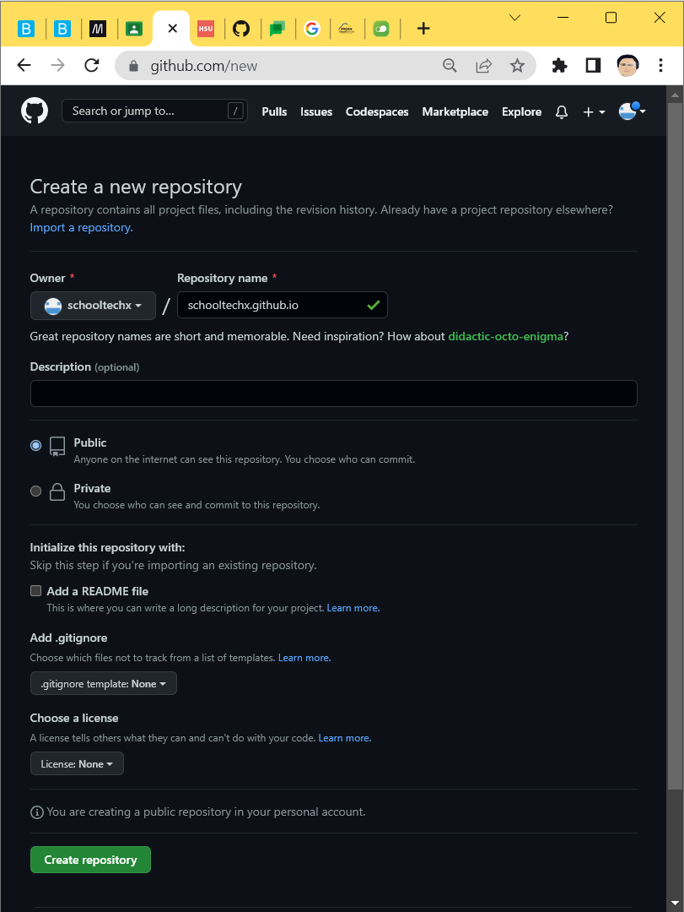
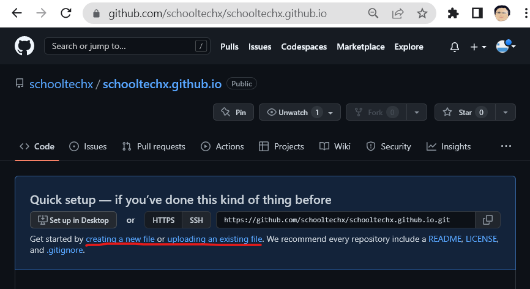
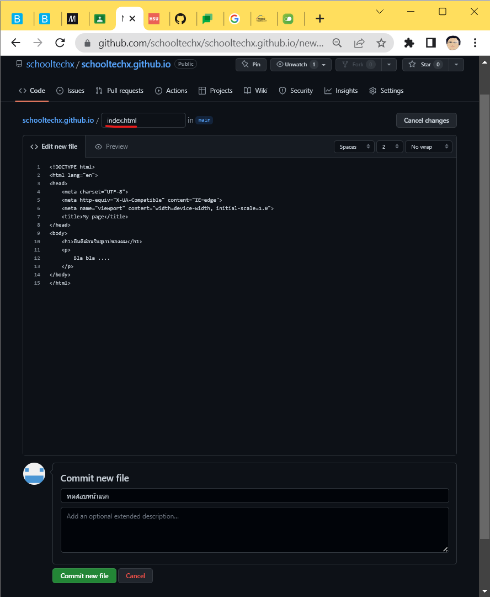
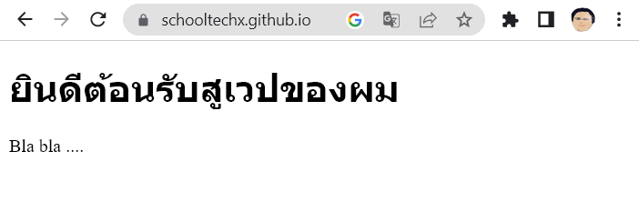
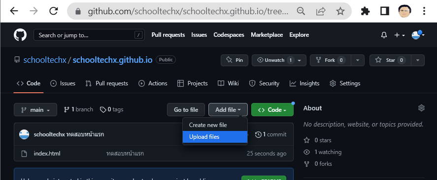

# สร้างเวปส่วนตัว
สร้างเวปส่วนตัวอย่างง่ายโดยนำ template มาแก้ไขเป็นเวปของตัวเอง นักเรียนจำเป็นต้องเข้าใจโครงสร้างและการทำงานของ HTML CSS JavaScript มาบ้างถึงจะทำงานนี้ได้
## Web Template
- เลือกแบบจาก [html5up](https://html5up.net) ลองดู Live Demo ของแต่ละอัน 

- ดาว์นโหลดมาจะได้ไฟล์ที่ zip ให้คลายไฟล์เป็นโฟลเดอร์แล้วใช้ Visual Studio เปิดโฟลเดอร์นั้น (ลากโฟลเดอร์แล้วโยนใส่ Visual Studio Code ก็ได้)
- ทำความเข้าใจโครงสร้างของ Template ว่าประกอบไปด้วยอะไรบ้าง  
- ทำการเปิดไฟล์ index.html ด้วย VS Code และ Chrome
- ลองแก้ไขข้อความไฟล์ index.html และใช้ Chrome เพื่อดูผลลัพท์ ค่อยๆแก้ระวังอย่าให้ Tag HTML ผิดฟอร์แม็ต ใช้ Edit/Find (Ctrl+F) หาข้อความที่เราจะแก้ไข
- หรือติดตั้ง Extension Live Server เพื่อจำลองการทำงานของ Web 
- เปิดใน Simple Browser: Show (Ctrl+Shift+P แล้วพิมพิมพ์) เมื่อแก้ไขจะเห็นผลลัพท์ทันที หรือใน Chrome ก็ได้
- Template ทั้งหมดที่ดาว์นโหลดมาจะมีภาพที่เบลอๆมาให้ ให้ใช้โปรแกรมแก้ไขภาพที่ถนัดจัดการนำภาพที่ต้องการมาใส่

- ถ้าหาไม่เจอว่าภาพหรือข้อความบนหน้าเวปกับในไฟล์ html อยู่ตรงไหน เปิดบน Chrome ให้คลิ้กขวาเลือก Inspect จะมีหน้าทางซ้าย ลองเอาเมาส์ไปจ่อเพื่อดูว่ามันคือส่วนไหนของหน้าเวป

## นำขึ้นเวป Github Page
เป็นบริการฟรีของ Github 
- ต้อง[สามัคร Github](https://github.com/signup?ref_cta=Sign+up&ref_loc=header+logged+out&ref_page=%2F&source=header-home)ก่อน
- ทำการสร้าง Repositories กดปุ่ม New
- ตั้งชื่อของ repo ให้เหมือนชื่อที่สมัคร github แล้วตามด้วย .github.io ยกตัวอย่างผมใช้ชื่อ schooltechx ก็จะตั้งชื่อ schooltechx.github.io

ย้ำนะครับถ้าตั้งชื่อไม่ถูก เวปจะใช้งานไม่ได้(404 Not found) ทำ repo แล้ว มันจะได้หน้าตาแบบนี้นะครับ ชื่อที่ใช้ใน github ต้องสอดคล้องกับชื่อ repo

schooltechx/schooltechx.github.io

เวลาเข้าเวปก็จะใช้ URL แบบนี้

https://schooltechx.github.io

- ทดลองสร้างไฟล์เลือก creating a new file

- ผมลองสร้างไฟล์ index.html เพื่อทดสอบ สามารถใส่ข้อความอธิบายเพิ่มเติม สำหรับการเพิ่มครั้งนี้(ไม่ใส่ก็ได้) แล้วกด Commit new file

- ทดสอบไปดูเวปที่พึ่งสร้าง อาจจะต้องรอเล็กน้อยถึงจะใช้ได้

- นำหน้าเวปที่แก้ไขจาก template มาอัปโหลดทับไฟล์เดิม หน้าเวปที่ถูกต้องต้องมี index.html อยู่นอกสุด แล้วมีโฟลเดอร์ต่างๆในโครงสร้างเดิม การย้ายตำแหน่ง ไฟล์หรือโฟลเดอร์อาจจะทำให้หน้าเวปมีความผิดพลาดได้

- github ใช้เก็บโค้ดโปรแกรม ถ้าเราใส่ใน repo ฟอร์แม็ตชื่อตามที่กำหนดของ Github Page เราก็จะได้หน้าเวปเราฟรีๆแล้ว นอกจากนี้โค้ดโปรแกรมที่เราเขียนขึ้นมา สามารถนำไปสร้างหน้าเวปอัตโนมัติเมื่อมีการแก้ไขได้ซึ่งจะได้เรียนในโอกาสต่อๆไป

## นำขึ้น Firebase
เป็นอีกที่ที่ขึ้นได้ฟรี ลองทำตาม[วีดีโอนี้](https://www.youtube.com/watch?v=tH-V9R8SM_Y&t=0s
)ได้ครับ

