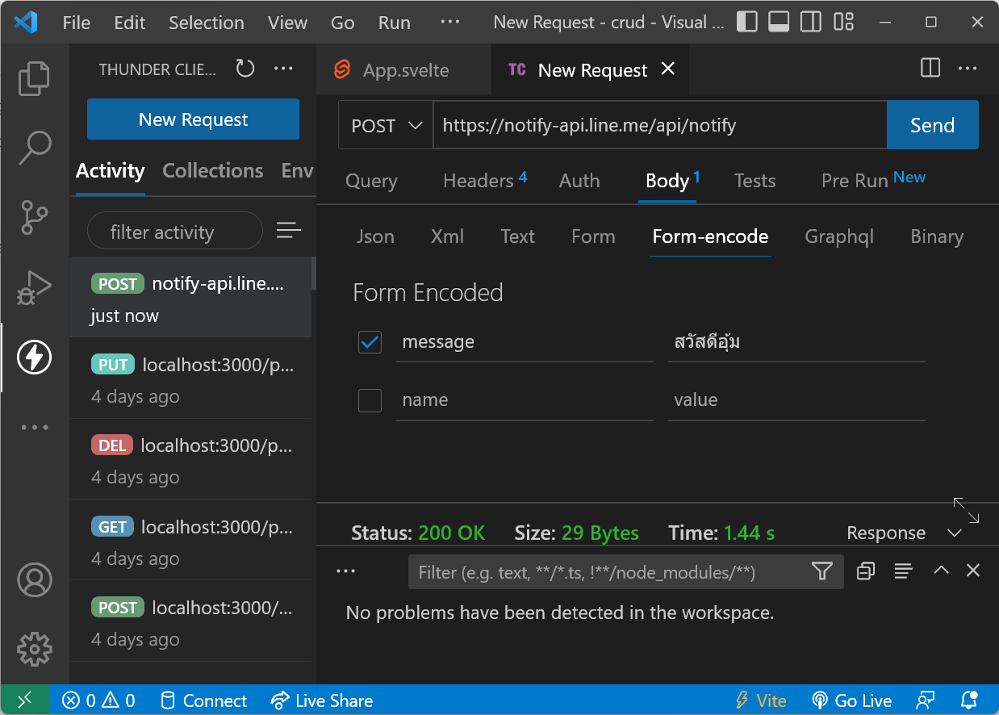

# WEB API
การใช้งานเวปแบบพื้นฐานไคลเอ็นต์จะเชื่อมต่อเซิร์ฟเวอร์ เพื่อใช้ส่งค่า(Request) แล้วได้ข้อมูลกลับมา(Respose) แล้วก็ตัดการเชื่อมต่อ ปกติจะไม่รู้เลยว่า Request ครั้งต่อไปจะเป็นไคลเอ็นต์เดิมหรือเปล่า บางทีเรียกว่าเป็นแบบ stateless จะต้องใช้  Cookie หรือวิธีการอื่นๆ ช่วยเพื่อให้รู้ว่าไคลเอ็นที่เข้ามาเป็นใคร แต่เดิมเซิร์ฟเวอร์ทำการสร้าง(Render)ทั้งหน้าเวปแล้วส่งกลับมาที่ไคลเอ็นต์ ปัจจุบันมีการเขียนเวปแบบ Single Page Application(SPA) แทนที่จะส่งทั้งหน้าเวป ก็จะส่งเฉพาะข้อมูลกลับมา(ใช้ Bandwidth น้อยกว่า) ผ่าน Web API โดยใช้โปรโตคอล HTTP ดั้งเดิม มีการกำหนดรูปแบบการส่งข้อมูลโดยใช้ 
fetch ซึ่งเป็นฟังก์ชันพื้นฐานที่อยู่บน Browser เพื่อ Request ไปที่เซิร์ฟเวอร์ โดยใช้ method (POST,GET,PUT,DELETE) ช่วยกำหนดวิธีการทำงาน

## CRUD
พื้นฐานการทำงานกับข้อมูลคือ สร้าง อ่าน เขียน ลบ ฝั่งเซิร์ฟเวอร์รับคำขอจากไคลเอ็น เมื่อทำขบวนการเสร็จแล้วจะส่ง status กลับมาถ้าสำเร็จจะได้ค่า 2xx ถ้าไม่สำเร็จจะส่งค่า 4xx หรือ 5xx ตัวอย่าง 
[Web API](https://www.moesif.com/blog/technical/api-design/Which-HTTP-Status-Code-To-Use-For-Every-CRUD-App/) ทำการ request/respose ดังนี้
- Create (POST) ส่งข้อมูลการสร้างไปด้วย ตอบกลับเป็น 201 Created
- Read (GET) ตอบกลับเป็น 200 OK 
- Update (PUT)  ส่งข้อมูลที่จะอัปเดตไปและตอบกลับเป็น 204 No Content
- Delete (DELETE) ตอบกลับเป็น 204 No Content
ข้อมูลที่ส่งไปและรับกลับมาจะอยู่ในส่วนของ body
เนื่องจากเป็นข้อตกลงข้อผู้ส่งและรับ บาง API อาจจะส่งค่าแตกต่างกันออกไป ให้ดูเอกสารประกอบการใช้งานด้วย

แนะนำให้ดูวีดีโอนี้ "Full Stack Dev: เข้าใจการทำงาน Web API" (แค่วีดีโอเดียว)

## Svelte Client
ตัวอย่างการใช้ [fetch](https://developer.mozilla.org/en-US/docs/Web/API/Fetch_API/Using_Fetch) 
ในการดึงข้อมูลจากเวปด้วย svelte ให้สร้างโปรเจ็ก Svelte แล้วแก้ App.svelte ตามตัวอย่างด้านล่าง
- [ตัวอย่าง](./load-users.svelte) ดึงข้อมูลจาก JsonPlaceholder  
- [ตัวอย่าง](./load-pokemon.svelte) ดึงข้อมูลจาก pokeapi

Note: ไฟล์ app.css แก้ text-align เป็น left จะได้ชิดด้านซ้าย

## Exercise CRUD
  ก่อนทำงานี้จำเป็นต้องทำการบ้านแสดง [รายชื่อผลไม้](../fruit-list/) ให้เรียบร้อยก่อน มาทำงาน Frontend สำหรับ CRUD ตัวอย่างการใช้งาน fetch() ดูที่ไฟล์ [fetch.js](./fetch.js)
- ให้ตั้ง [json-server](https://github.com/typicode/json-server) ตามในวีดีโอข้างต้น ใช้ db.json ตามตัวอย่างในเวป
- ทดสอบ CRUD ผ่าน Thunder Client หรือ Postman เพื่อให้เข้าใจการทำงาน  
- สร้างโปรเจ็ก Svelte แล้วเอาเนื้อหาจาก [crue_exercise.svelte](./crud_exercise.svelte) หรือ [crue_exercise2.svelte](./crud_exercise2.svelte) (ใช้ group-inputs) ไปใส่ใน App.svelte แล้วเรียนรู้การทำงาน
- ในตัวอย่างสามารถดึงรายการ Post จาก เซิร์ฟเวอร์ออกมาแสดง กรอกข้อมูลในฟอร์มเพื่อสร้าง(Create)โพสได้ 
- ให้นักเรียนเขียนโค้ดเพื่อ Update และ Delete เพื่อให้โปรแกรมทำงานอย่างสมบูรณ์ 
- ไฟล์ต้นแบบจะมีการใช้ Svelte onMount, Arow Function, group-inputs ลองอ่านเอกสารใน Comment เพิ่มเติมด้วย
- งานมีการเรียนรู้หลายเรื่อง ด้วยเวลาจำกัดผมจะไม่สอบโดยละเอียด ถ้าไม่เข้าใจตรงไหนให้สอบถามมาได้ครับ
- การส่งงานให้นำไฟล์ App.svelte มาส่ง

### การศึกษาเพิ่มเติม
ทำการศึกษาเพิ่มเติม เพื่อทำให้เข้าใจการพัฒนา Frontend มากยิ่งขึ้น
- ให้ลองดัดแปลงข้อมูลเพิ่มเติม สร้างฟอร์มที่เหมาะสม ทำเป็นโปรแกรมแบบต่างๆดู ปรับแต่งให้สวยงามเช่นใช้ SvelteStrap, [Carbon Component Svelte](https://carbon-components-svelte.onrender.com/)  
- ลองทำเป็น[หลายๆหน้า](https://youtu.be/EPf7Ptwgvu8) 
- ลองหา API จากที่อื่นๆ มาฝึกใช้งาน

## Exercise Todo List with Line Notify
- ให้แก้โค้ด [todo-list.svelte](./todo-list.svelte) ให้เก็บข้อมูล json-server
- ไปที่ https://notify-bot.line.me/th/ กดเข้าสู่ระบบ ทำเหมือนตอนใช้ Line for PC
- หน้าแรกตรงบนขวาให้เลือก หน้าของฉัน
- กดปุ่ม "ออก Token" ใส่ชื่อ เลือกตัวเราเอง หรือกลุ่มที่ต้องการส่งข้อความ แนะนำให้ส่งให้ตัวเองดูก่อน กดปุ่ม "ออก Token" ให้ทำการคัดลอก token มาเก็บไว้เพราะถ้าปิดหน้านี้แล้วจะไม่สามารถขอดูได้ ต้องสร้างใหม่
- ไปที่ Thunder Client สร้าง POST ไปที่ https://notify-api.line.me/api/notify มีค่า header ดังนี้

Content-Type application/x-www-form-urlencoded

Authorization Bearer [Token ที่สำเนาเก็บไว้]

!

- ส่วน Body เลือก Form-encode แล้วใส่ message ตามต้องการ

- ให้หาทางเขียนโปรแกรม Todo ของเราให้สามารส่ง Line notify เพื่องานเสร็จ(ขีดกลางข้อความ) 

### อ่านเพิ่มเติม
- [ลองเล่น Line Nitify โดยใช้งานผ่าน postman](https://medium.com/amiearth/%E0%B8%A5%E0%B8%AD%E0%B8%87%E0%B9%80%E0%B8%A5%E0%B9%88%E0%B8%99-line-nitify-%E0%B9%82%E0%B8%94%E0%B8%A2%E0%B9%83%E0%B8%8A%E0%B9%89%E0%B8%87%E0%B8%B2%E0%B8%99%E0%B8%9C%E0%B9%88%E0%B8%B2%E0%B8%99-postman-39119378a60a)
- [Fetch X-Www-Form-Urlencoded With Code Examples](https://www.folkstalk.com/tech/fetch-x-www-form-urlencoded-with-code-examples/)
- ตัวอย่างการใช้ [fetch](https://developer.mozilla.org/en-US/docs/Web/API/Fetch_API/Using_Fetch) 
