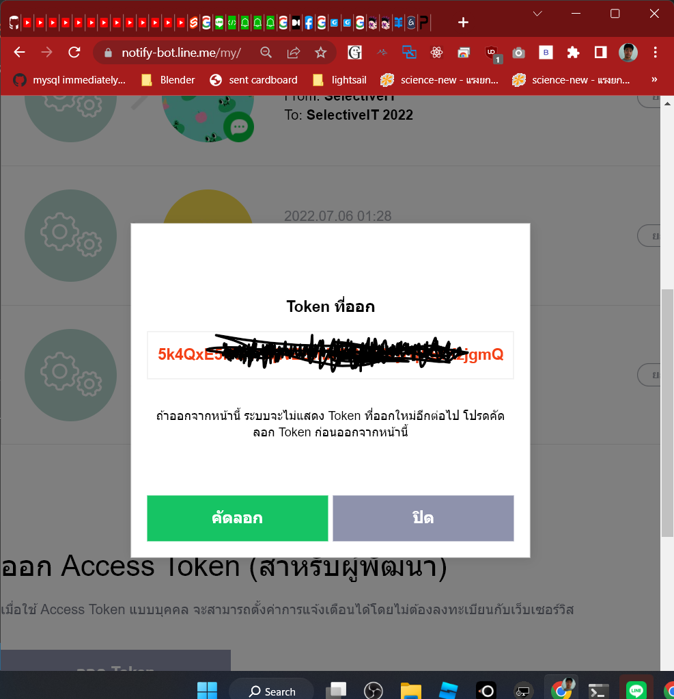

# Line
Line เป็นแอปยอดนิยมของไทยและญี่ปุ่น เราสามารถเขียนโปรแกรมเสริมได้ ข้อดีคือเราไม่จำเป็นต้องพัฒนา Mobile App เอง 
ผู้ใช้งานไม่จำเป็นต้องติดตั้งโปรแกรมเพิ่ม เราใช้บริการ API ของ Line โดยใช้ความรู้ในการเขียน Web Application ก็พอ

## Exercise Line Notify
เนื่องจาก API ของ Line ถ้าเรียกบน Browser จะติด CORS เดี๋ยวจะเอาไปใช้ตอนทำ Backend ตอนนี้ให้ลองฝึกใช้ไปก่อน 
Line Notify มีข้อดีคือฟรีใช้เพื่อแจ้งเตือนตนเอง หรือคนในกลุ่ม ใช้งานง่าย 

- ไปที่ https://notify-bot.line.me/th/ กดเข้าสู่ระบบ ทำเหมือนตอนใช้ Line for PC
- หน้าแรกตรงบนขวาให้เลือก หน้าของฉัน
- กดปุ่ม "ออก Token" ใส่ชื่อ เลือกตัวเราเอง หรือกลุ่มที่ต้องการส่งข้อความ แนะนำให้ส่งให้ตัวเองดูก่อน กดปุ่ม "ออก Token" ให้ทำการคัดลอก token มาเก็บไว้เพราะถ้าปิดหน้านี้แล้วจะไม่สามารถขอดูได้ ต้องสร้างใหม่
- ไปที่ Thunder Client สร้าง POST ไปที่ https://notify-api.line.me/api/notify มีค่า header ดังนี้

Content-Type: application/x-www-form-urlencoded

Authorization: Bearer [Token ที่สำเนาเก็บไว้]

line-notify-post.png)!

- ส่วน Body เลือก Form-encode แล้วใส่ message ตามต้องการ

line-notify-body.png)

หลังจากทำสำเร็จแล้วให้สร้างโปรเจ็ก Sveltekit ให้ก็อปปี้[ในโฟเดอร์ notify](./notify/) ไปไว้ในโฟลเดอร์ rout/notify แก้ตัวแปร notify_token ในไฟล์ [+page.server.js](./notify/%2Bpage.server.js) ให้เป็น token ที่เราทำการขอมา ก็จะใช้โปรแกรมได้แล้ว

### อ่านเพิ่มเติม
- [ลองเล่น Line Nitify โดยใช้งานผ่าน postman](https://medium.com/amiearth/%E0%B8%A5%E0%B8%AD%E0%B8%87%E0%B9%80%E0%B8%A5%E0%B9%88%E0%B8%99-line-nitify-%E0%B9%82%E0%B8%94%E0%B8%A2%E0%B9%83%E0%B8%8A%E0%B9%89%E0%B8%87%E0%B8%B2%E0%B8%99%E0%B8%9C%E0%B9%88%E0%B8%B2%E0%B8%99-postman-39119378a60a)
- [Fetch X-Www-Form-Urlencoded With Code Examples](https://www.folkstalk.com/tech/fetch-x-www-form-urlencoded-with-code-examples/)
- [ใชิ line notify กับ esp32](https://www.robotsiam.com/article/76/%E0%B9%82%E0%B8%9B%E0%B8%A3%E0%B9%80%E0%B8%88%E0%B8%84-iot-esp32-%E0%B9%81%E0%B8%88%E0%B9%89%E0%B8%87%E0%B9%80%E0%B8%95%E0%B8%B7%E0%B8%AD%E0%B8%99%E0%B8%94%E0%B9%89%E0%B8%A7%E0%B8%A2-line-notify-%E0%B9%80%E0%B8%A1%E0%B8%B7%E0%B9%88%E0%B8%AD%E0%B8%A1%E0%B8%B5%E0%B8%9C%E0%B8%B9%E0%B9%89%E0%B8%9A%E0%B8%B8%E0%B8%81%E0%B8%A3%E0%B8%B8%E0%B8%81)
- ตัวอย่างการใช้ [fetch](https://developer.mozilla.org/en-US/docs/Web/API/Fetch_API/Using_Fetch) 

## LineOA
LineOA เหมาะกับการทำ Mobile App ราคาถูกแค่มีความรู้การเขียน Web App ก็สามารถใช้งานได้แล้ว หลักๆเราใช้ความสามารถในการ chat(ใช้ Bot อ่านได้) เพื่อส่งข้อความกลับมาในรูปแบบต่างๆ และ Reach Menu ซึ่งจะไปเรียก Web App ในเบื้องหลังอีกที ให้ลองทำตามขั้นตอนในเวปนี้จนสำเร็จครับ
[วิธีสร้าง Rich Menu ใน LINE OA ให้มีถึง 20 ปุ่ม แบบ No Code!](https://medium.com/linedevth/20-buttons-in-richmenu-dbbf21fde88f) 

