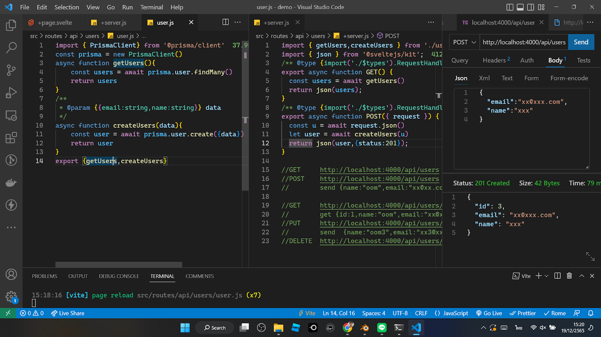

# Web App + Web API
ให้นักเรียนสร้างเวปแอปด้วยตัวเอง โดยใช้ความรู้ที่เรียนไปประกอบเข้าด้วยกัน และศึกษาเพิ่มเติม
- งาน [CRUD](https://github.com/schooltechx/youtube/tree/main/classroom/self-improvement-classroom/fetch#exercise-crud) สำหรับทำ Frontend เบื้องต้น นักเรียนสามารถทำ Single Page Application โดยใช้ Svelte ทำฟอร์มกรอกข้อมูล แล้วเอาข้อมูลไปเก็บใน Json Server 
- Web API บน SvelteKit เพื่อเก็บ Contact (ชื่อกับ email)  
- การใช้งานฐานข้อมูลผ่าน ORM Prisma กับ ฐานข้อมูล SQLite 

เพื่อวัดความเข้าใจในการประยุกต์ความรู้ที่เรียนมา ให้นักเรียนใช้ SvelteKit สร้างแอป "Contact List" 

- Frontend ทำฟอร์มส่งข้อมูลคล้ายงาน [CRUD](https://github.com/schooltechx/youtube/tree/main/classroom/self-improvement-classroom/fetch#exercise-crud) ที่ผ่านมา ให้นำโค้ดเดิมมาแก้ไข  
- Backendใช้ API ที่สร้างเอง เก็บข้อมูลใน ฐานข้อมูล SQLite ผ่าน Prisma ใช้แทน json-server
- ตัวอย่างการ Read และ Create แบบง่าย ให้ดูในภาพที่แนบกับใบงานนี้ โปรแกรมที่นักเรียนทำ ควรมีการตรวจสอบความถูกต้องของข้อมูล และจัดการ error ให้ดีกว่าตัวอย่างที่ให้ไป ให้ศึกษาจากวีดีโอการใช้ try catch 



ข้อมูลของ Contact List จะต่างกับในวีดีโอ ให้นักเรียนสร้างโมเดลขึ้นมาเอง ให้ศึกษาจากเอกสารของ Prisma ประกอบไปด้วย
- id : ตัวเลข เพิ่มค่าอัตโนมัติ
- email : ตัวหนังสือ อีเมลล์ จำเป็นต้องมีและห้ามซ้ำ
- name : ตัวหนังสือ เป็นชื่อ จำเป็นต้องมี
- tel : ตัวหนังสือ เป็นเบอร์โทรศัพท์ ยูสเซอร์จะใส่หรือไม่ใส่ก็ได้ไม่บังคับ

## แนะนำให้ศึกษา Part 3-5
ในแต่ละวีดีโอจะมีโค้ดตัวอย่าง และเนื้อหาซึ่งสามารถนำไปใช้ในการทำงานนี้ได้

[](https://youtu.be/pGsCDl4GJJU "SvelteKit Full Stack Part-3-แนะนำการทำ Web API")

SvelteKit Full Stack Part-3-แนะนำการทำ Web API

[](https://youtu.be/4tdfzpepxv4 "SvelteKit Full Stack Part-4 - Form Actions")

SvelteKit Full Stack Part-4 - Form Actions

[](https://youtu.be/i_kcfA8_4bQ "SvelteKit Full Stack Part-5 - Form Actions and Prisma ORM")

SvelteKit Full Stack Part-5 - Form Actions and Prisma ORM

## ให้สร้างโปรเจ็กตามนี้ครับ  
``` sh
npm create svelte@latest db-actions
cd db-actions
npm install
npm install prisma --save-dev
npx prisma init --datasource-provider sqlite
code .
# เพิ่ม model ใน schema.prisma ให้ วิเคราะห์จากโจทย์
npx prisma migrate dev --name init
npx prisma studio
``` 

## อ่านเพิ่มเติม 

- https://www.prisma.io/docs/getting-started/quickstart
- https://www.prisma.io/docs/concepts/components/prisma-client/crud
