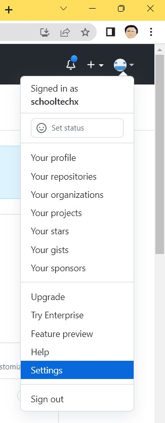
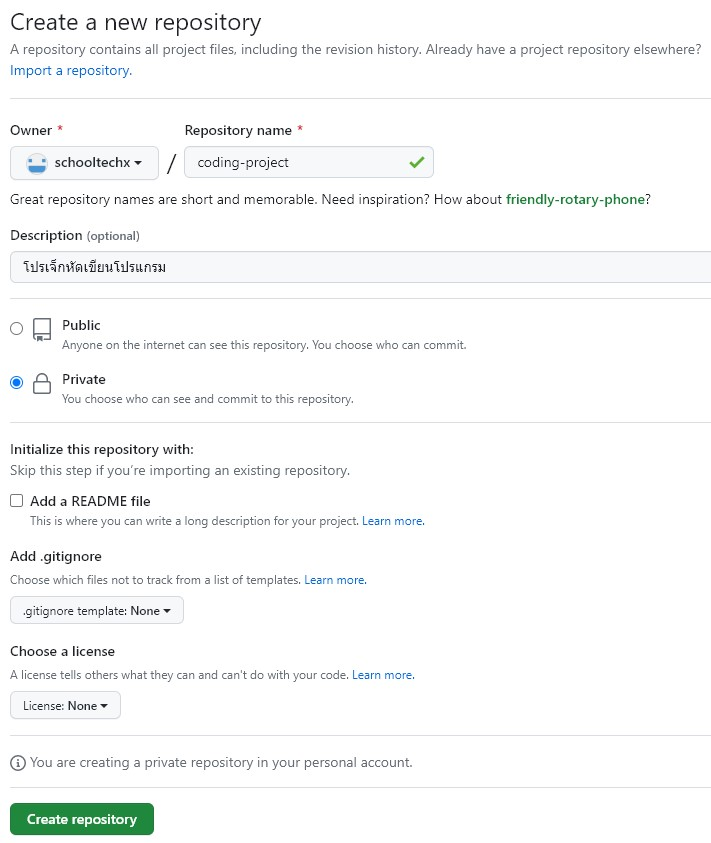
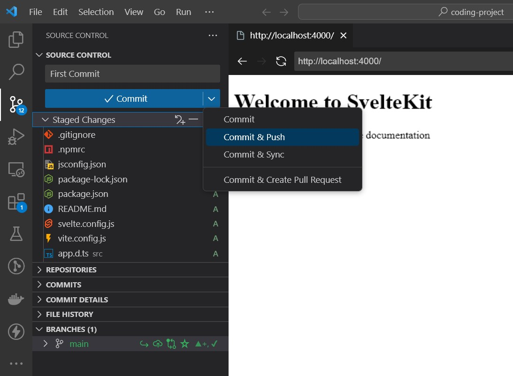

# การตั้งค่า Github
Git เป็นเครื่องมือที่จำเป็นอย่างมากสำหรับนักพัฒนาซอฟแวร์ในปัจจุบัน ใช้ในการบริหารจัดการโค้ด เช่นคุมเวอร์ชั่น สามารถย้อนไปรุ่นก่อนหน้า เปรียบเทียบความแตกต่าง ทำงานเป็นทีมได้ง่าย ฯลฯ ในเอกสารนี้จะแสดงวิธีการติดตั้งและนำโค้ดขึ้น Github แบบง่ายๆ 

## เตรียมตัว
- [ให้สมัครใช้งาน Github](https://github.com/)
- สำหรับวินโดว์ให้[ติดตั้ง Git](https://github.com/git-guides/install-git)
- [ติดตั้ง VS Code](https://code.visualstudio.com/download) พร้อม Extension
  - Git Graph
  - GitHub Pull Requests and Issues
  - GitHub Repositories
- สำหรับผู้ใช้วินโดว์ 10 แนะนำให้ติดตั้ง [Windows Terminal](https://github.com/microsoft/terminal/releases) ด้วย (วินโดว์ 11 มีให้แล้ว)

## สร้าง SSH Key
SSH Key เป็นกุญแจสำหรับเข้าใช้ระบบโดยไม่ต้องใช้รหัสผ่าน มีการสื่อสารแบบเข้ารหัส นิยมใช้กับ ssh บน Linux จะเก็บ Private Key 
ไว้ในเครื่อง Desktop/Laptop ที่เราใช้งานอยู่(Local)
ส่วนเซิร์ฟเวอร์ (Remote) ที่จะเข้าใช้เก็บ Public Key
- สร้าง [SSH key](https://docs.github.com/en/authentication/connecting-to-github-with-ssh/generating-a-new-ssh-key-and-adding-it-to-the-ssh-agent) 
 ด้วยคำสั่ง(แก้อีเมลล์ให้เหมาะสม) ssh-keygen -t ed25519 -C "your_email@example.com"
- ใส่ชื่อไฟล์ในตัวอย่างตั้งชื่อ id_github ถ้ายังไม่เคยสร้างมาก่อน แนะนำให้ตามค่า default ไปก่อนเพราะจะสร้างโฟลเดอร์ .ssh ให้ด้วย
- Enter passphrase ให้เคาะผ่านไม่ต้องป้อน แล้วเคาะผ่านอีกรอบ
- ตัวอย่างด้านล่างทำบนวินโดว์ ส่วน macOS และ Linux ก็ทำคล้ายกัน
``` 
PS C:\dev\test> ssh-keygen -t ed25519 -C "your_email@example.com"
Generating public/private ed25519 key pair.
Enter file in which to save the key (C:\Users\oom/.ssh/id_ed25519): id_github
Enter passphrase (empty for no passphrase):
Enter same passphrase again:
Your identification has been saved in id_github.
Your public key has been saved in id_github.pub.
The key fingerprint is:
SHA256:b12g1KqPmX+0BdYF2c0y7wMqaZ7lHk+ABtOmKQzsSVI your_email@example.com
The key's randomart image is:
+--[ED25519 256]--+
|   E          .=.|
|  o     .  .  + =|
| . +   o o. o. = |
|  + +   *..ooo. .|
|   o o oSo+o..o. |
|      . .* +o....|
|        + Bo.+  .|
|         O .*    |
|        +.+o .   |
+----[SHA256]-----+
PS C:\dev\test> dir
    Directory: C:\dev\test

Mode                 LastWriteTime         Length Name
----                 -------------         ------ ----
-a----         4/13/2023  12:01 AM            419 id_github
-a----         4/13/2023  12:01 AM            105 id_github.pub
```
- ย้ายไฟล์ id_github.pub  และ id_github  ซึ่งเป็นกุญแจ สาธารณะ และ ส่วนตัว 
ไปเก็บในโพลเดอร์ .ssh (แนะนำว่าครั้งแรกทำตาม default จะนำไปใส่โฟลเดอร์ .ssh ให้เลย และกำหนดสิทธิ์ที่เหมาะสมให้ด้วย) ไฟล์อจะอยู่โฟลเดอร์ .ssh ใต้โฮมโฟลเดอร์  สมมุติผมใช้ login ชื่อ oom 
ไฟล์จะอยู่ที่ "C:\Users\oom\\.ssh\id_github" สำหรับ  
Linux และ macOS จะอยู่ที่ "~/.ssh/" 
- ในโฟลเดอร์ .ssh เปิดหรือสร้างไฟล์ชื่อ config (ถ้ายังไม่มีให้สร้างใหม่ แนะนำให้ใช้ VS Code ในการสร้าง) 
แล้วใส่ 4 บรรทัดนี้ลงไป
```
Host github.com
  HostName github.com
  User git
  IdentityFile ~/.ssh/id_github
```

ต้องตั้งสองค่านี้จะเป็นชื่อและอีเมลล์ที่แสดงเวลาเอาโค้ดขึ้น github
``` bash
git config --global user.name "oom"
git config --global user.email "oom@xxx.com"
```
## เพิ่ม Public Key ใน Github

ให้ทำ[ตามเอกสาร](https://docs.github.com/en/authentication/connecting-to-github-with-ssh/adding-a-new-ssh-key-to-your-github-account) 
ของ Github ทำตามในภาพนี้ เมนูบนขวาเลือก Setting



เลือก SSH and GPG Keys แล้วกดปุ่ม New SSH Key


เอาเนื้อหาในไฟล์ id_github.pub มาใส่ในนี้ แล้วกดปุ่ม Add SSH Key


## สร้าง Repository และใช้งาน
ไปที่ Repositories แล้วกดปุ่ม New


สร้าง Repository ถ้าเลือกเป็น Private เราจะเห็นคนเดียว ส่วน Public ทุกคนจะอ่านได้



สร้าง Repository เสร็จแล้ว ในภาพจะแสดงวิธีการนำไปใช้งาน


### Clone 
ถ้าจะใช้ ssh-key ที่ทำมาก่อนหน้า
ให้เปลี่ยนจาก HTTPS ไปเลือก SSH แล้วก็อปค่าเก็บไว้
ทำการ clone โปรเจ็กเปล่า ที่ Terminal ให้เรียกคำสั่ง
``` bash
git clone git@github.com:schooltechx/coding-project.git
cd coding-project
```
โฟลเดอร์นี้ก็จะพร้อมที่จะเอาโค้ดของโปรแกรมมาใส่แล้ว ในโฟลเดอร์ coding-project จะมีโฟลเดอร์ .git ซ่อนอยู่จะมีคอนฟิกต่างๆของ Git

### Create Local
init ที่เครื่อง(local) แล้วทำการเชื่อมต่อกับ remote repository ตัวอย่างนี้จะสร้างไฟล์ test.txt .gitignote แล้วเพิ่มเข้าไปใน repo
```
mkdir proj1
cd proj1
git init
touch test.txt
touch .gitignore
git add .
git commit -m "first commit"
# create git repo from web ui and link to local
git branch -M main
git remote add origin git@github.com:schooltechx/coding-project.git
git push -u origin main
```
### Push Exist
หรือเริ่มจากโปรเจ็กที่มีอยู่แล้ว
```
git remote add origin git@github.com:schooltechx/coding-project.git
git branch -M main
git push -u origin main
```


## VS Code

VS code รองรับ Git ในตัวสามารถใช้งาน git ผ่าน UI ได้เลย (อย่าลืมติดตั้ง git)ตัวอย่างนี้ทำการ Clone หรือ Create Local จะได้โปรเจ็กเปล่าๆ แล้วทำการสร้างโปรเจ็ก SvelteKit ไว้ข้างใน ตอนนี้เราอยู่ในโฟลเดอร์ coding-project 

``` bash
npm create svelte@latest .
# สร้างโปรเจ็กในโฟลเดอร์นี้เลย กด Enter
# Directory not empty. Continue? ให้ตอบ y 
npm install
# เปิดโฟลเดอร์ปัจจุบันด้วย VS Code
code .
```
ตรงเมนู Source Control ที่อยู่ด้านซ้าย จะแสดงโค้ดที่ยังไม่ได้ขึ้น Repository อยู่ใต้คำว่า Changes ให้กดปุ่ม + (Staged All Changes) โค้ดที่พร้อมขึ้นจะย้ายไปอยู่ Staged Changes ตรงช่อง Message ให้ใส่ "First Commit" หรือคำอธิบายอะไรก็ได้ ตรงปุ่มสีฟ้ากดลูกศรลง Commit & Push เท่านี้โค้ดใหม่ของ SvelteKit ก็จะขึ้น Repository แล้ว



ถ้าโค้ดมีการแก้ไขหรือเพิ่มใหม่ก็จะอยู่ใต้คำว่า Changes ให้ทำเหมือนเดิมก็จะเอาขึ้น Repository ตอนนี้โค้ดจะอยู่ใน Branch ชื่อ main 

## เพิ่มเติม
- แนะนำให้ดูเรื่องการสร้างไฟล์ [.gitignore](https://www.atlassian.com/git/tutorials/saving-changes/gitignore) ของแต่ละภาษาและ Framework เพื่อจะได้ไม่ต้องเอาไฟล์ที่ไม่จำเป็นขึ้น Repository

- สำหรับการสำเนา private key ไปเครื่องอื่นหรือคอนฟิกที่เกี่ยวกับ ssh ถ้ามีการเซ็ตสิทธิ์ไม่เหมาะสม จะทำให้ใช้งานไม่ได้ หลักการง่ายๆคือ โฟลเดอร์ ~/.ssh และที่อยู่ภายใน ให้ยูสเซอร์เจ้าของอ่านได้คนเดียว ให้ใช้คำสั่ง
```
chmod og-rw -R ~/.ssh
```
สำหรับวินโดว์การกำหนดสิทธิ์[ต้องทำดังนี้](https://superuser.com/questions/1296024/windows-ssh-permissions-for-private-key-are-too-open)


- สำหรับคนที่ github หลาย account ให้ตั้งชื่อใน ~/.ssh/config เพื่อแยกการใช้งาน 
```
ost github.com
  HostName github.com
  User git
  IdentityFile ~/.ssh/github-schooltechx

Host github.com-work
  HostName github.com
  User git
  IdentityFile ~/.ssh/github-work

```
ตอน clone account แยกกันทำดังนี้ (เวลาใช้งาน อย่าลืมแก้ email และ user ตอนใช้งานด้วย)
```sh
## git ส่วนตัว
git clone git@github.com:schooltechx/coding-project.git
## git ที่ทำงาน
git clone git@github.com-work:company/private-project.git

```