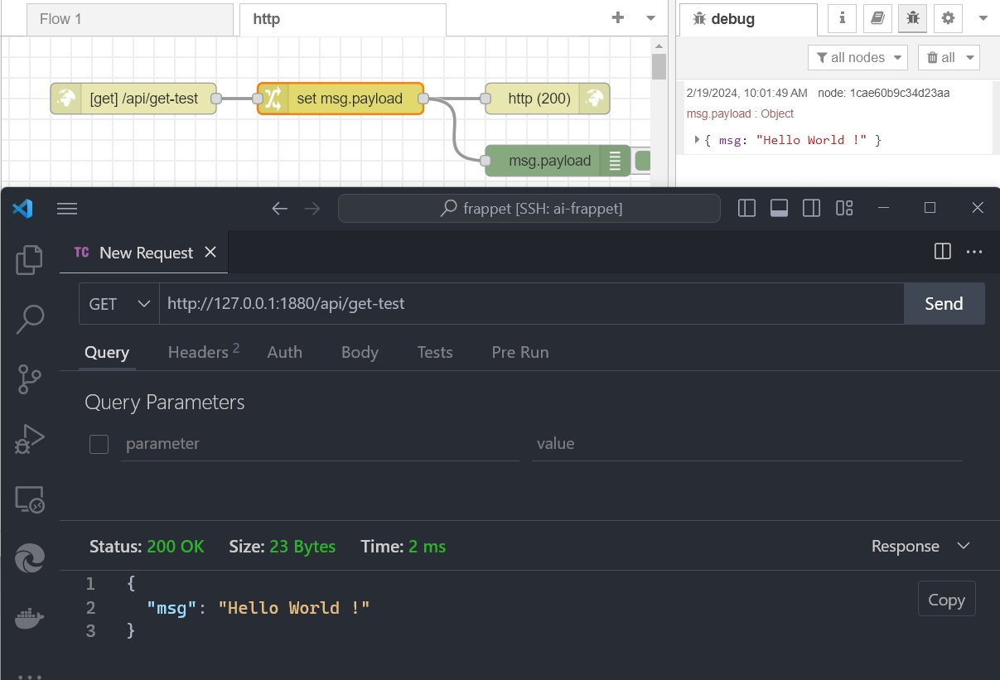
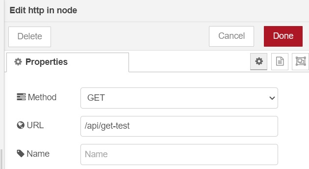
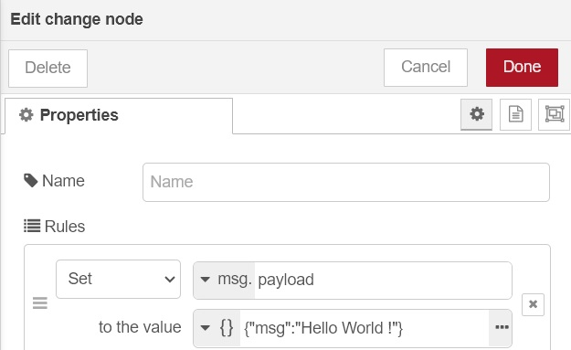
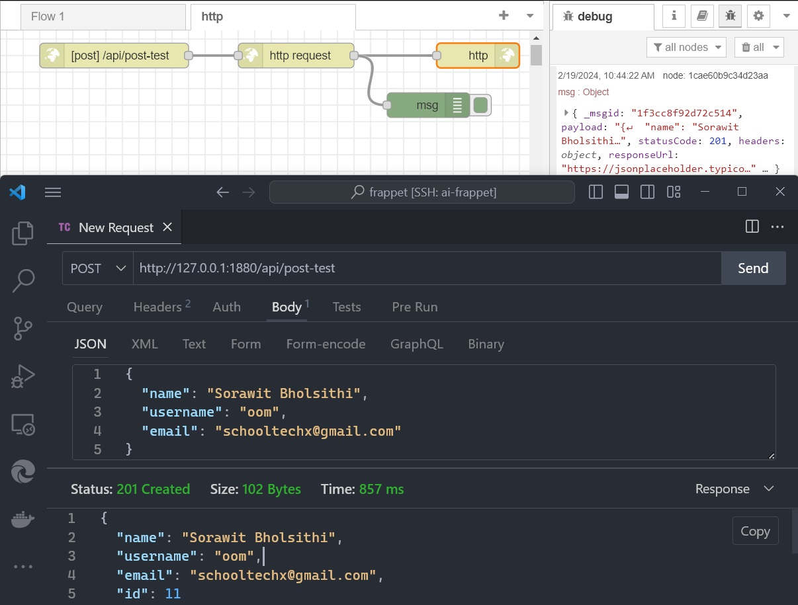
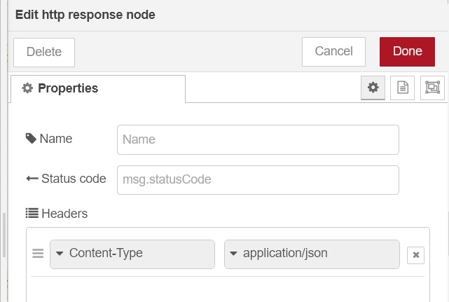
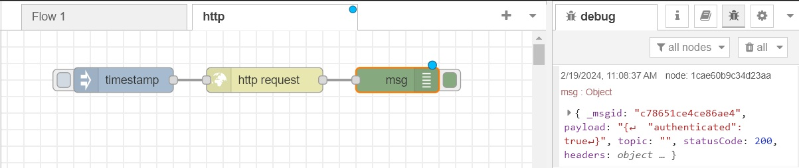
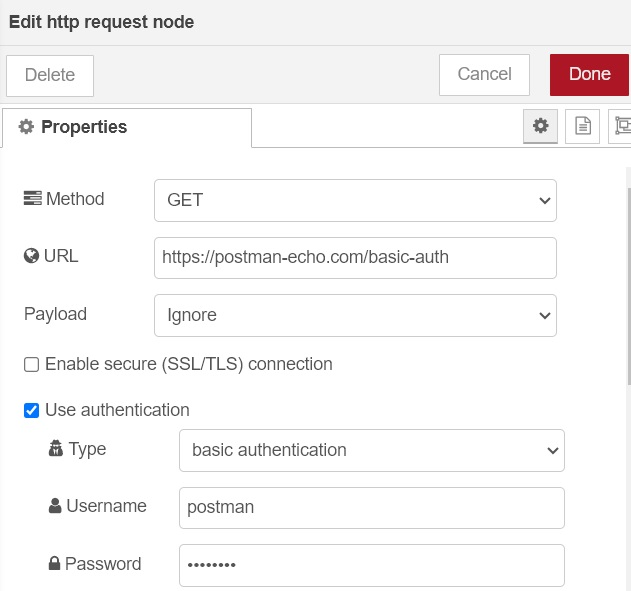
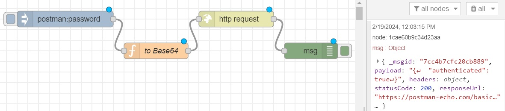
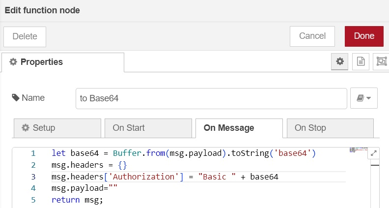

# HTTP

สามารถสร้าง Web API ได้ง่ายๆ โดยไม่ต้องเขียนโค้ด ใช้เป็น Tricker เพื่อรัน Workflow ได้ หรือทำ HTTP Request เพื่อเรียก Web API อื่นๆก็ได้

ใน network จะมีโหนด http in, http response, http request
## Simple GET
ตัวอย่างการทำ Web API แบบง่ายๆ แสดง "Hello World !"

ตั้งค่าโหนต 
- http in เป็น Method GET, URL /api/get-test 
- change เซ็ต msg.payload เป็น {"msg":"Hello World!"}
- http response ให้ Status code 200

## Simple POST
ตัวอย่างการทำ API POST โดยที่เบื้องหลังส่งไปที่ https://jsonplaceholder.typicode.com/users ใส่ body เป็นข้อมูลยูสเซอร์ตามภาพ

ตั้งค่าในโหนด http response ให้ Status code ว่างเอาไว้ เพื่อให้ใช้จาก jsonplaceholder ที่ส่งมา ตัวอย่างเซ็ต Content-Type เป็น "application/json" เพราะที่ส่งกลับมาเป็นมาเป็น "text/html"

## Basic Authentication

ตัวอย่างการทำ Basic Authentication ยูสเซอร์ postman รหัสผ่าน password ส่ง request ไปที่ https://postman-echo.com/basic-auth

ทำใน http request ตรงๆได้เลย

ถ้าทำผ่านโปรแกรม สามารถเซ็ต header ให้เหมาะตามกับชนิดของ Authentication  

inject postman:password ผ่าน payload มาที่ฟังก์ชั่น "to Base64" เพื่อเซ็ต Authorization headers

