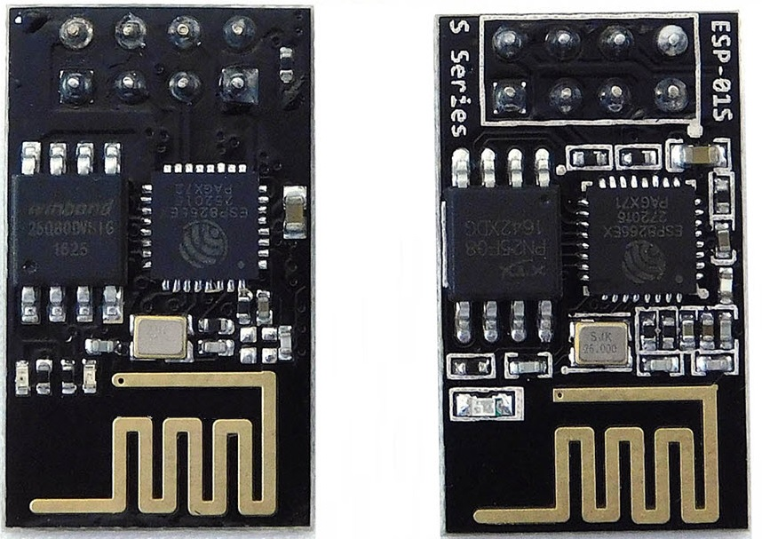
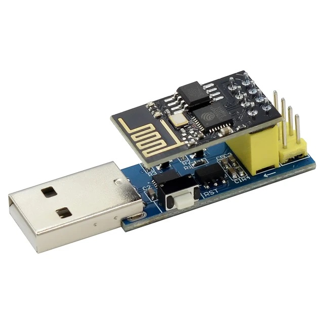
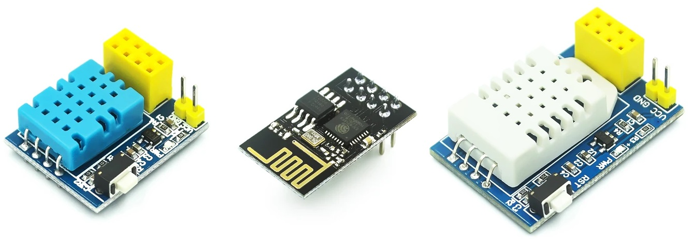
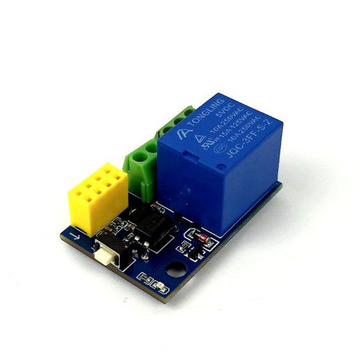
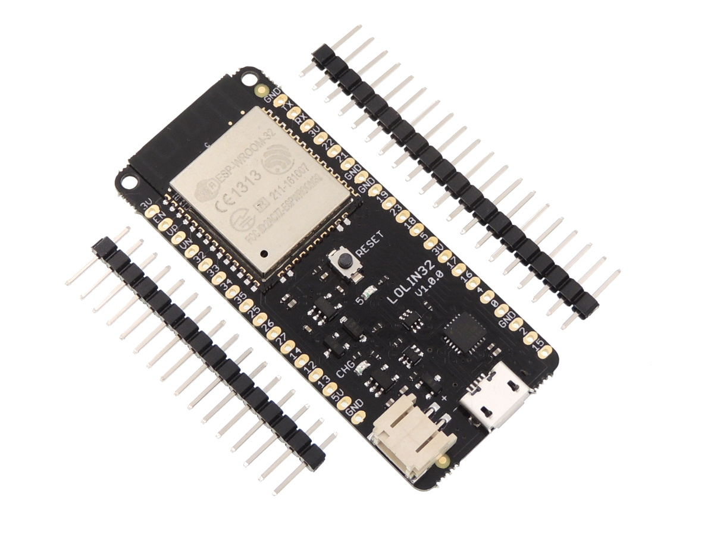

# Board
บอร์ดสำหรับงาน IOT มีหลายประเภท

## ESP01/ESP01s
MCU ESP2866 ราคาถูก ขนาดเล็ก ต่อ Wifi ได้ 

เวลาต่อกับคอมพิวเตอร์ต้องต่อกับ USB 2 Serial

ใช้งานได้ง่ายถ้ามีโมลดูล ในภาพ DHT11 DHT22 สำหรับวัดอุณหภูมิและความชื่น

[โมดูลรีเลย์](https://th.cytron.io/p-esp01-250ac-10a-relay-module)

# Wemos Lolin32
MCU ESP2866 มีขั้วต่อกับแบ็ต 3.3v และชาร์ตไฟได้

