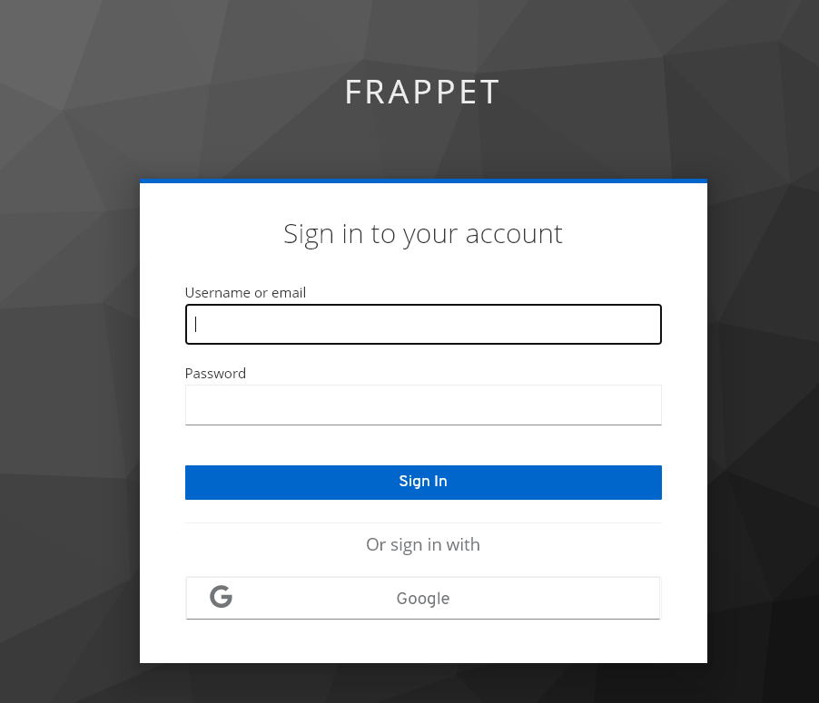
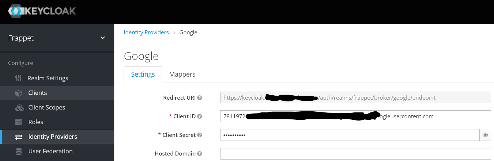
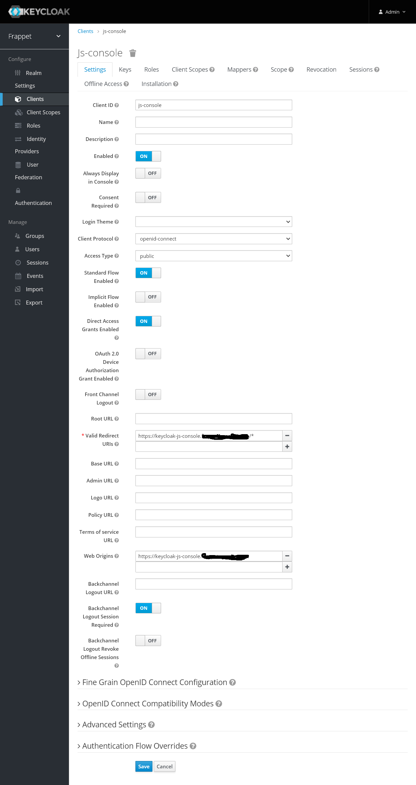

# Keycloak ทำ SSO กับ Google

ตัวอย่าง Keycloak ทำ Single Sign On 
- ใช้ยูสเซอร์ของ google (Identity Provider ) เพื่อเข้าใช้งาน (Sign in with Google)
- Keycloak ใช้งานร่วมกับ กับ Jitsi Meet และ js-console. 
- จะมียูสเซอร์ meeting ของ keycloak login ใช้งานได้ด้วย 
- ในตัวอย่างเป็นการทดสอบอย่างง่ายไม่ได้ต่อฐานข้อมูล เหมาะกับ POC หรือ Development
- ให้ทำความเข้าใจจาก docker-compose.yaml 
- ติดตั้ง mailhog เผื่อจะต้องทดสอบส่งเมลล์ออกจากระบบ 

## เตรียมตัวก่อนทำ

- ติดตั้ง docker, docker compose ให้เรียบร้อยตัวอย่างทำบนเครื่อง Linux 
- ติดตั้ง Jitsi แนะนำให้ใช้ docker-compose พร้อมเซ็ต domain เป็น meet.xxx.com ไฟล์ .env เซ็ตสองค่านี้
ENABLE_AUTH=1  
AUTH_TYPE=jwt  
JWT_APP_ID=jitsi  
วิธีการติดตั้งโดยละเอียด  
<https://jitsi.github.io/handbook/docs/devops-guide/devops-guide-docker/>
- เซิร์ฟเวอร์ที่ใช้งานมีดังนี้ (เซ็ต reverse proxy ตามนี้)
https://meet.xxx.com  
https://meet-auth.xxx.com  
https://keycloak.xxx.com  
https://keycloak-js-console.xxx.com  

## docker-compose.yaml 

    version: "3.1"
    services:
    keycloak:
        image: jboss/keycloak
        ports:
        - 7700:8080
        volumes:
        - ./data:/opt/jboss/keycloak/standalone/data
        environment:
        - KEYCLOAK_USER=admin
        - KEYCLOAK_PASSWORD=changeme
        - PROXY_ADDRESS_FORWARDING=true
    js-client:
        image: nginx
        volumes:
        - ./js-client:/usr/share/nginx/html:ro
        ports:
        - 7701:80
    mailhog:
        image: mailhog/mailhog
        logging:
        driver: 'none'  # disable saving logs
        ports:
        - 7702:1025 # smtp server
        - 7703:8025 # web ui
    jitsi-keycloak:
        image: d3473r/jitsi-keycloak
        container_name: jisi-keycloak
        restart: unless-stopped
        environment:
        JITSI_SECRET: 83D8F671657020295CBBE977E90FB313
        DEFAULT_ROOM: TeamMeeting
        JITSI_URL: https://meet.xxx.com/
        JITSI_SUB: meet.xxx.com
        volumes:
        - ./jitsi-config:/config
        ports:
        - 7704:3000

## Google
- ตั้งต่า OAuth เพื่อใช้งาน ในตัวอย่างเป็นของ google workspace จะมีเป็น domain ของตัวเอง
- ตั้งค่า Google ตามเวปนี้
<https://keycloakthemes.com/blog/how-to-setup-sign-in-with-google-using-keycloak>  

## keycloak
- keycloak สร้าง Realm frappet,สร้างยูสเซอร์ meeting, สร้าง client js-console และ jitsi-keycloak

- เอาค่า Client ID , Client Secret มาใส่ใน keycloak

## js-console
- เป็นตัวอย่างการใช้งาน keycloak-js มันจะจัดการการ Authen และ Session cookie ให้จะงา่ยกว่าทำเอง
- ก็อปปี้ js-console ไปใส่ใน ./js-client เอาจากที่นี้
<https://github.com/keycloak/keycloak/tree/main/examples/js-console/src/main/webapp>

- แก้ไฟล์ index.html ชี้ตำแหน่ง keycloak.js ให้ถูก
- แก้ keycloak.json ให้ถูกต้อง

        {
            "realm" : "frappet",
            "auth-server-url" : "https://keycloak.frappet.synology.me/auth",
            "ssl-required" : "external",
            "resource" : "js-console",
            "public-client" : true
        }

- อ่านเพิ่มเติมการใช้งาน keycloak-js
<https://github.com/keycloak/keycloak-documentation/blob/main/securing_apps/topics/oidc/javascript-adapter.adoc>

- ตั้งค่า Client ของ js-console

## jitsi-keycloak
- Jitsi มีระบบยูสเซอร์แบบ internal และ LDAP ไม่มี Oauth ดังนั้นจะใช้ Authen แบบ JWT จะใช้การแชร์ secret กับ jitsi-keycloak เพื่อสร้าง token เพื่อเข้าใช้งาน Jitsi
- อ่านวิธีการใช้งาน jitsi-keycloak 
<https://github.com/D3473R/jitsi-keycloak>

- ตั้งค่า Client ของ jitsi-keycloak ส่วนใหญ่ตาม default

- เซ็ตค่า jitsi-config/keycloak.json

        {
        "realm" : "frappet",
        "auth-server-url" : "https://keycloak.frappet.synology.me/auth",
        "resource" : "jitsi-keycloak"
        }

