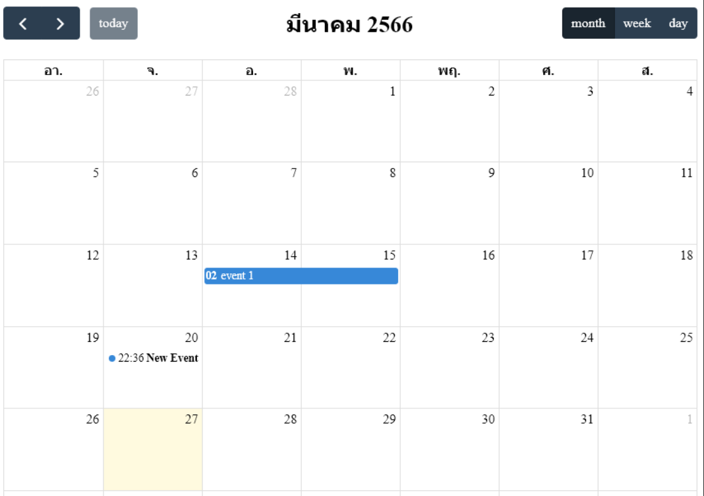

# FullCalendar

## English Description
I am Thai developer. I like [FullCalendar](https://fullcalendar.io) because it support [Buddhist calendar](https://en.wikipedia.org/wiki/Buddhist_calendar) out of the box. It not
support Svelte by default. I use code from [here](https://github.com/YogliB/svelte-fullcalendar/issues/804#issuecomment-1471639707). This is TypeScript code. You need to modify to work with JavaScript.

### Thai Description
ผมชอบ [FullCalendar](https://fullcalendar.io)  ใช้ locale ไทยจะแสดงเป็น พ.ศ. ได้เลย รองรับ React,Vue,Angular,JavaScrpt ยังไม่รองรับ Svelte ตรงๆ ที่หาเจอส่วนใหญ่ไม่เวิร์กเจอปัญหา Break change และไม่รองรับ TypeScript ค้นจนเจอตัวอย่างจาก[ที่นี้](https://github.com/YogliB/svelte-fullcalendar/issues/804#issuecomment-1471639707) ใช้ โค้ดเขียนด้วย TypeScript ถ้าใครจะใช้กับ JavaScript ต้องแก้จากโค้ด FullCalendar.svelte นะครับ ยังไม่เคยทดสอบกับ Svelte 4 นะครับแต่ก็น่าจะเวิร์ก

## NPM Install
``` bash
npm create svelte@latest calendar-test # Skeleton and TypeScript project  
cd calendar-test
npm i --save-dev @fullcalendar/core
npm i --save-dev @fullcalendar/common
npm i --save-dev @fullcalendar/daygrid
npm i --save-dev @fullcalendar/timegrid
npm i --save-dev @fullcalendar/interaction
```
## +page.js
``` ts
<script lang="ts">
	import FullCalendar from '$lib/FullCalendar.svelte';
	import daygridPlugin from '@fullcalendar/daygrid';
	import timegridPlugin from '@fullcalendar/timegrid';
	import interactionPlugin from '@fullcalendar/interaction';
	//import thLocale from '@fullcalendar/core/locales/th';
	let calendarRef;
	let options = {
		initialView: 'dayGridMonth',
		plugins: [daygridPlugin, timegridPlugin, interactionPlugin],
		locale: 'th', //or thLocale
            headerToolbar: {
			left: 'prev,next today',
			center: 'title',
			right: 'dayGridMonth,timeGridWeek,timeGridDay',
		},
            selectable: true,
		droppable: true,
		editable: true,
		events: [
			{ id: '1',title: 'New Event', start: new Date() },
            { id: '2', start: '2023-03-07T02:00:00', end: '2023-03-08T07:00:00', title: 'event 1' },
		],
	};
</script>
<FullCalendar bind:this={calendarRef} {options} />
```
## $lib/FullCalendar.svelte
``` ts
<script lang="ts">
	import { onMount } from 'svelte';
	import { Calendar } from '@fullcalendar/core';
	import type { CalendarOptions } from '@fullcalendar/core';
	let classes: string | null = null;
	export { classes as class };
	export let style: string | null = null;
	export let options: CalendarOptions;
	export function getAPI() {
		return calendar;
	}
	let calendarEl: HTMLElement;
	let calendar: Calendar;
	$: canBeInitiated =
		options && options.plugins && options.plugins.length && calendarEl && !calendar;
	$: {
		if (calendar && options && options.plugins && options.plugins.length) updateCalendarOptions();
		if (canBeInitiated) {
			initCalendar();
		}
	}
	onMount(async () => {
		console.log("canBeInitiated ",canBeInitiated)
		console.log("options",options)
		if (!canBeInitiated) return;
		initCalendar();
		return () => {
			calendar && calendar.destroy();
		};
	});
	function initCalendar() {
		calendar = new Calendar(calendarEl, options);
		calendar.render();
	}
	function updateCalendarOptions() {
		calendar.pauseRendering();
		calendar.resetOptions(options);
		calendar.resumeRendering();
	}
</script>
<div bind:this={calendarEl} class={classes} {style} />
```

## Example
- [Sample for TypeScript and JS Framework](https://github.com/fullcalendar/fullcalendar-examples/blob/main/typescript-scheduler/src/index.ts)
