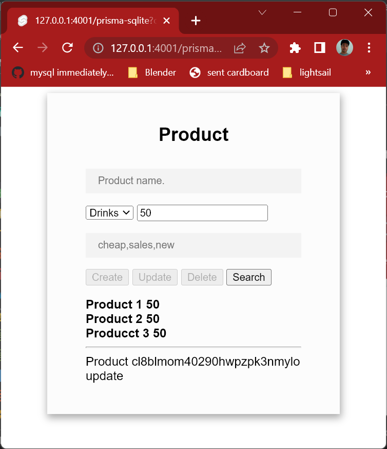

# SvelteKit with SQLite (power by [Prisma](https://www.prisma.io/) )

This is simple CRUD in one page. I use sqlite database. 
It will be created after migration . 
You have to copy files to correct location of svelte project for running this demo

## Prisma

Prisma is Object–relational mapping 
([ORM](https://en.wikipedia.org/wiki/Object%E2%80%93relational_mapping)) 
tools. Convert from [model](https://www.prisma.io/docs/concepts/components/prisma-schema/data-model) 
to code and database schema

I don't want to make complex demo so I use similar schema for most of database demo. 
you can use prisma studio to add edit delete data in databae

## File
- src/routes/prisma-sqlite/+page.server.js
- src/routes/prisma-sqlite/+page.sevelte.js
## install
    npm create svelte@latest my-app
    cd my-app
    npm install
    npm install prisma --save-dev
    npx prisma init --datasource-provider sqlite
    # modify prisma/schema.prisma before migrate
    npx prisma migrate dev --name init
    # copy file to project
    docker compose up -d mongo
    code .
    npm prisma studio
## prisma/schema.prisma

    generator client {
        provider = "prisma-client-js"
    }
    datasource db {
        provider = "sqlite"
        url      = env("DATABASE_URL")
    }
    model Product {
        id   String @id @default(cuid())
        name String
        category String
        price Int
        tags String
    }

## note
I found mongo not found error sometime. I don't know how to fix it yet. Some annoy problem can fix by. 
- npm update
- reload visual studio code

please check [main document](https://github.com/schooltechx/youtube/tree/main/svelte/svelte-kit) for other tutorial
