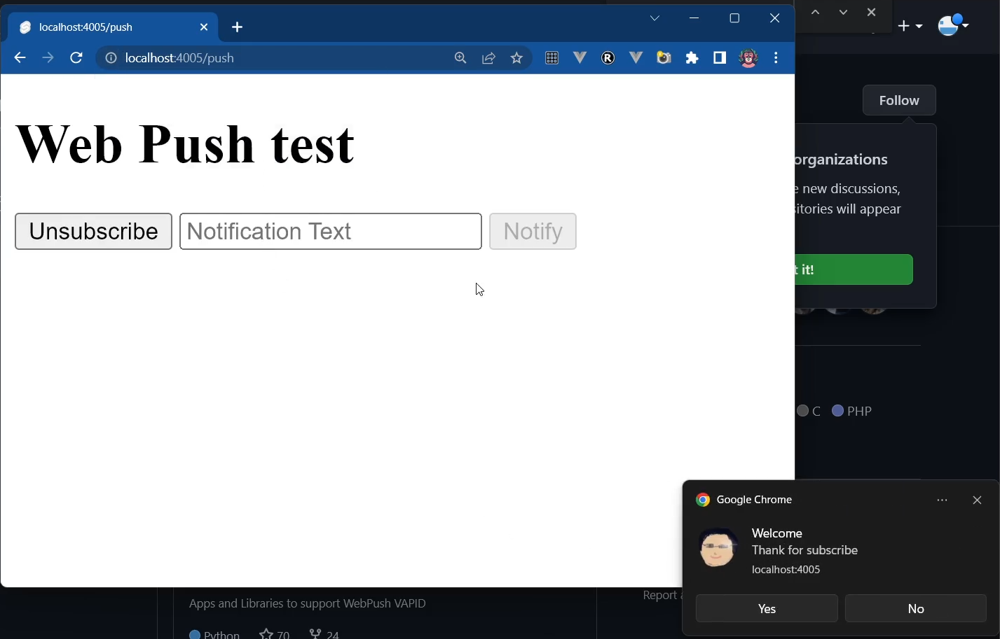

# Web Push

  หรือบางทีเรียก Push notification ทำให้เวปแอปสามารถส่งการแจ้งเตือนให้ผู้ใช้ เมื่อใดก็ได้โดยที่ Browser ปิดอยู่ก็ได้ จะไปปรากฎที่การแจ้งเตือนของระบบปฎิบัติการ ตำแหน่งการแสดงการแจ้งเตือนขึ้นขึ้นกับระบบปฎิบัติการ Push notification เป็นบริการฟรี เซิร์ฟเวอร์สำหรับการส่งข้อความรับผิดชอบโดยผู้ผลิด Browser แต่ละเจ้า แต่การเขียนโปรแกรมเป็นมาตรฐานเดียวกัน ยกระดับให้ส่งแจ้งเตือนได้เหมือน mobile app และมักใช้ในการทำ Progressive Web App (PWA) การทำงานเบื้องหลังจะใช้ Service Worker ช่วย การทำงานคล้ายกับ [Web Worker](../web-worker/) แต่จะเฉพาะทางมากกว่า ใช้ใน PWA เป็นหลัก เอกสารในเวปค่อนข้างเข้าใจยากหวังว่าตัวอย่างโค้ดและวีดีโอจะทำให้เข้าใจการทำงานมากขึ้น 



วีดีโอเป็นต้วอย่างสำหรับการเรียน จริงๆแล้วค่า Subscription สำหรับการส่ง Nitification ให้แต่ละ client ควรเก็บในฐานข้อมูลของ Backend โค้ดเขียนด้วย SvelteKit ใช้ ES Module สามารถปรับไปใช้กับ JavaScript Framework อื่นๆได้ไม่ยากนัก การส่ง Notification จะขึ้นกับ Browser และเครื่อง ดังนั้นผู้ใช้งานหนึ่งคนจะมีการแสดง notification ซ้ำซ้อนในเครื่องเดียวกันได้ 

[](https://www.youtube.com/watch?v=y_FwlkxtrvA&list=PLWMbTFbTi55ODDrafKItIGpJZl8r3XpyT&index=15 "SvelteKit Full Stack Part-7- Web Push ")

## ขั้นตอนการทำ
- ใช้ Library web-push ในการจัดการทั้งหมดเพื่อลดขั้นตอนยุ่งยาก
- ใช้ web-push สร้าง Public/Private Key สำหรับแอปของเรา เพื่อการสื่อสารอย่างปลอดภัย
- Frontend ลงทะเบียน Service Worker 
- Frontend ได้ Public Key ไปใช้สมัครรับข้อความจากเซิร์ฟเวอร์ (Subscribe)
- เมื่อ Subscribe แล้วจะได้ลิงค์ ของ API (endpoint) ที่ใช้ส่งข้อความมาหา frontend ให้ส่งไปให้เซิร์ฟเวอร์เก็บไว้
- เซิร์ฟเวอร์เอาไปเก็บไว้ในฐานข้อมูลเพื่อใช้ส่งข้อมูลในโอกาสต่อๆไป
- ในวีดีโอตัวอย่าง Frontend จะส่ง endpoint พร้อมข้อความ Welcome ให้ Backend ส่งมาหาตัวเอง หลัง Subscribe เสร็จ
- ส่งข้อความจากฟอร์มก็จะต้องส่ง endpoint ไปทุกครั้งเพื่อในตัวอย่างไม่มีฐานข้อมูลในการเก็บ

## ติดตั้ง
- สร้างโปรเจ็ก SvelteKit ใช้ JSDoc และติดตั้ง web-push และสร้าง public/private key
```
npm install web-push -g
web-push generate-vapid-keys --json
```
- ให้ก็อปเนื้อหาในโฟลเดอร์ [push](./) (+page.svelte, subscribe/+server.js) ไปใส่ใน src/routes/push 
- ให้ก็อปเนื้อหาในโฟลเดอร์ [static](./static) (static/sw.js,static/schooltech.png) ไปใส่โฟลเดอร์ static ที่อยู่รูตของโปรเจ็ก

## เอกสาร
- https://github.com/web-push-libs/web-push
- https://web.dev/notifications/
- https://developer.mozilla.org/en-US/docs/Web/API/ServiceWorkerGlobalScope/push_event
- https://web.dev/push-notifications-overview/
- https://web.dev/push-notifications-web-push-protocol/

## อื่นๆ
chrome://serviceworker-internals/
